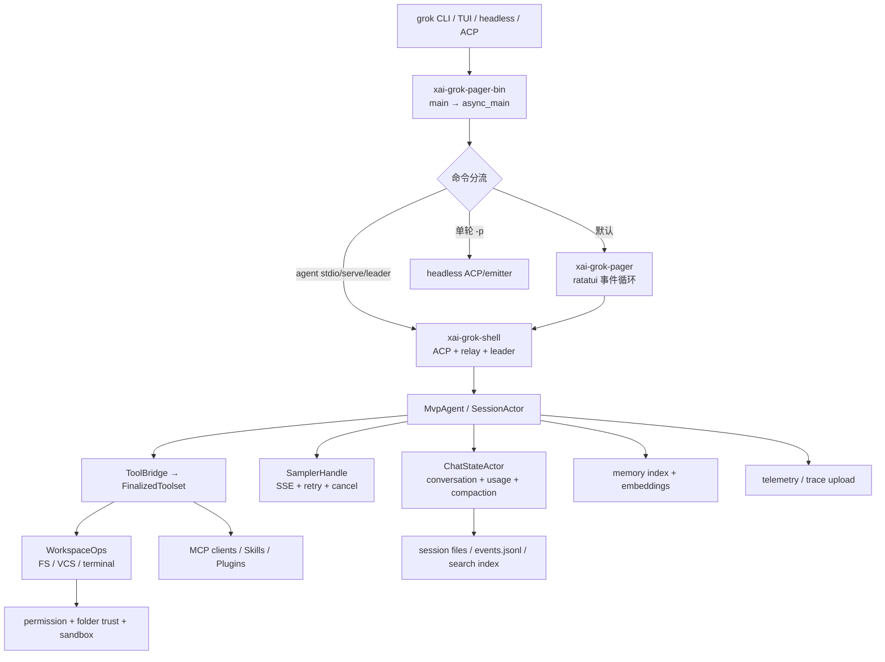

# Grok Build 源码分析 Wiki

在线阅读：<https://qqnhy.github.io/grok-build-analysiswiki/>（如果你把仓库改成了其他 owner/repo，请相应修改链接；Pages 构建会自动读取 `GITHUB_REPOSITORY`）。

本目录是对 `xai-org/grok-build` checkout 的静态源码分析，写法参考
`claude-code-analysiswiki`：先给结论，再解释运行链路，并为关键结论附源码路径与行号。
分析对象是 SpaceXAI 的 Rust 终端 coding agent（命令名 `grok`），不是 xAI 服务端。

## 发布到 GitHub Pages

仓库已经包含与参考站相同的纯静态发布层：`docs-site/build.js` 读取根目录的
`analysis/` 和 `diagrams/`，GitHub Actions 再把生成的 `docs-site/dist/` 部署到 Pages。
本地预览：

```bash
cd docs-site
npm ci
npm run docs:verify
npm run docs:preview
```

首次发布时，在 GitHub 创建一个空仓库（默认分支 `main`），然后：

```bash
git init
git branch -M main
git add README.md SOURCE_REF analysis diagrams docs-site .github .gitignore CONTRIBUTING.md NOTICE.md
git commit -m "Publish Grok Build analysis wiki"
git remote add origin git@github.com:<owner>/<repo>.git
git push -u origin main
```

在仓库的 **Settings → Pages → Build and deployment** 将 Source 设为 **GitHub Actions**；
也可以在 Actions 页面手动运行 `Deploy analysis wiki to GitHub Pages`。PR 提交会由 `.github/workflows/check-docs.yml` 自动执行构建和断链校验，不会触发 Pages 部署。之后每次修改
`analysis/`、`diagrams/` 或 `docs-site/` 都会自动重建。`dist/` 和 `node_modules/` 是构建产物，不需要提交。

源码证据链接固定到 `SOURCE_REF` 中记录的公开 commit；更新分析快照时，先更新该文件，
再运行 `npm run docs:verify`，避免页面链接指向错误版本。若将源码仓库设为私有，页面仍会
生成，但读者无法打开源码证据，应改用公开镜像或随 Wiki 提供获授权的源码快照。

发布前还应在 `NOTICE.md` 的基础上选择适合你的分析文字和图表的许可证；上游源码的许可
和商标不因本 Wiki 的发布而改变。

## 快速结论

Grok Build 不是“一个带聊天框的脚本”，而是一个以 session actor 为中心、以统一
Tool registry 为能力总线、以 workspace/sandbox 为宿主边界的多入口平台：

1. `xai-grok-pager-bin` 是 composition root，负责 CLI 分流、认证、遥测、信任和不可逆
   sandbox 的启动顺序。
2. `xai-grok-shell` 的 `MvpAgent` 把 ACP 请求转换为 session 命令；每个 session 有串行
   dispatch lock，采样、工具、持久化和事件都围绕 turn 编排。
3. `xai-grok-tools` 把内置、MCP、兼容层工具统一成 typed/JSON 双层接口；工具流必须是
   `Progress* + Terminal`，因此 TUI、headless、ACP 可以共享同一执行内核。
4. 上下文不是单纯截断：`xai-chat-state` actor 保存会话状态，`xai-grok-compaction`
   进行 full-replace 压缩，`xai-compaction-transcript` 把压缩片段落盘为可检索 Markdown。
5. 安全边界是组合式的：folder trust gate 仓库配置，permission 决定工具动作，sandbox
   限制文件/网络/子进程，MCP OAuth 与凭据存储隔离，遥测层对 secret、用户路径和内容做门控/脱敏。

## 一图总览



## 目录与章节

### 总体架构与运行时

- [01 总体架构与模块边界](analysis/01-architecture-overview.md)
- [02 启动顺序与 CLI 分流](analysis/02-startup-and-cli.md)
- [03 Agent loop 与 ACP](analysis/03-agent-loop-and-acp.md)
- [04 Tool Call、registry 与流式协议](analysis/04-tool-call-runtime.md)
- [05 Sampling、SSE 与模型 API](analysis/05-sampling-and-model-api.md)

### 状态、上下文与扩展

- [06 Session、Transcript、Resume 与搜索](analysis/06-session-persistence.md)
- [07 Memory、Embedding 与 Compaction](analysis/07-memory-and-compaction.md)
- [08 MCP、Skills、Plugins、Hooks 与 Workflow](analysis/08-mcp-skills-plugins.md)
- [11 Multi-Agent、Leader、后台任务与 Worktree](analysis/11-multi-agent-leader-worktree.md)

### 边界、安全与界面

- [09 Sandbox、Permission 与 Folder Trust](analysis/09-sandbox-permission-trust.md)
- [10 安全、隐私与 Telemetry](analysis/10-security-privacy-telemetry.md)
- [12 TUI、Headless 与 Relay](analysis/12-tui-and-headless.md)
- [13 Workspace、文件系统与 VCS](analysis/13-workspace-filesystem-vcs.md)

### 工程与附录

- [14 测试、性能与工程实践](analysis/14-tests-performance-and-engineering.md)
- [15 代码证据索引](analysis/15-code-evidence-index.md)
- [16 源码树与 crate 地图](analysis/16-source-tree.md)
- [17 总结与可验证结论](analysis/17-summary.md)

### 隐私与扩展审计专题

- [18 用户隐私、数据流与规避建议](analysis/18-privacy-and-data-flow.md)
- [19 隐藏命令、Feature Flags 与产品彩蛋](analysis/19-hidden-features-and-commands.md)
- [20 Prompt 管理、规则注入与上下文预算](analysis/20-prompt-management.md)

### 组件体系与架构图

- [Crate / 组件总览](docs-site/docs/components/component-overview.md)
- [Crate 组件索引](docs-site/docs/components/component-index.md)
- [CLI 启动流程](diagrams/startup-flow.md)
- [Agent 执行流程](diagrams/agent-flow.md)
- [Tool Call 调用流程](diagrams/tool-call-flow.md)
- [MCP 集成流程](diagrams/mcp-flow.md)
- [Memory 管理流程](diagrams/memory-flow.md)
- [Sandbox 权限控制](diagrams/sandbox-flow.md)

参考 Wiki 还包含组件函数级拆解、竞品对比和负面关键词专题；本目录只对 Grok Build
当前 checkout 中有直接源码证据的主题展开，不把其他产品的行为臆测为 Grok 功能。

## 分析口径

- 版本基线：源码镜像 `xai-org/grok-build` 的 commit `72a61251fcffb464bcc687aeb5a998e5a98ec0c9`，
  由根目录 `SOURCE_REF` 固定；源仓库自身的 `SOURCE_REV` 是上游 monorepo 同步号，二者不要混用。
  项目 README 说明该树会从 monorepo 周期性同步（`grok-build/README.md:31`）。
- 规模：workspace 的产品成员（`crates/` + `prod/mc/`，不含 4 个 vendored `third_party`
  成员）约 93 个 Cargo package；在对应的 `xai-org/grok-build` checkout 中按 git 跟踪的 `crates/codegen/`、`crates/common/`、
  `prod/mc/` 中 `*.rs` 统计，共 2,893 个文件、423,653 行（包含测试源码；可用
  `git ls-files -- 'crates/codegen/**/*.rs' 'crates/common/**/*.rs' 'prod/mc/**/*.rs' | xargs wc -l` 复核）。
- 证据格式：`path:line` 表示源码中的可复核位置；“推断”会明确标注，不把产品行为猜测成
  已实现事实。
- `.codegraph/` 不存在，因此本次使用 `rg`、`nl` 和源码文档进行静态取证。

## 关键数据落点

```text
$GROK_HOME/
├── auth.json                    # xAI 登录凭据（auth crate）
├── mcp_credentials.json         # MCP OAuth，独立于 auth.json
├── sessions/<encoded-cwd>/<session-id>/
│   ├── updates.jsonl             # 会话主 transcript
│   ├── chat_history.jsonl        # 可继续采样的 conversation
│   ├── summary.json              # 标题、模型、cwd 等元数据
│   ├── events.jsonl              # typed 生命周期/工具事件（可选事件日志）
│   └── compaction/               # segment_NNN.md + INDEX.md
├── memory/                       # 全局与 workspace Markdown memory
└── leader.sock / active-sessions # 进程协作与存活登记
```

上述布局分别由 `xai-grok-memory/src/lib.rs:1`、
`xai-grok-session-events/src/log.rs:19`、`xai-compaction-transcript/src/lib.rs:14` 和
shell session persistence 模块实现；具体字段和兼容行为见第 06、07 章。

## 阅读建议

先读第 01、02 章建立调用图，再读第 04、05 章理解一次 turn 的执行边界，随后按需求查阅
第 06–13、18–20 章。第 15 章把“结论 → 源码证据”反向索引，适合审计或代码走查。

## 免责声明

本文档是对当前 checkout 的技术研究记录；配置、远端策略、feature flag 和服务端行为
可能改变最终效果。涉及凭据、网络上传或执行未信任代码时，应以实际部署策略和官方文档为准。
