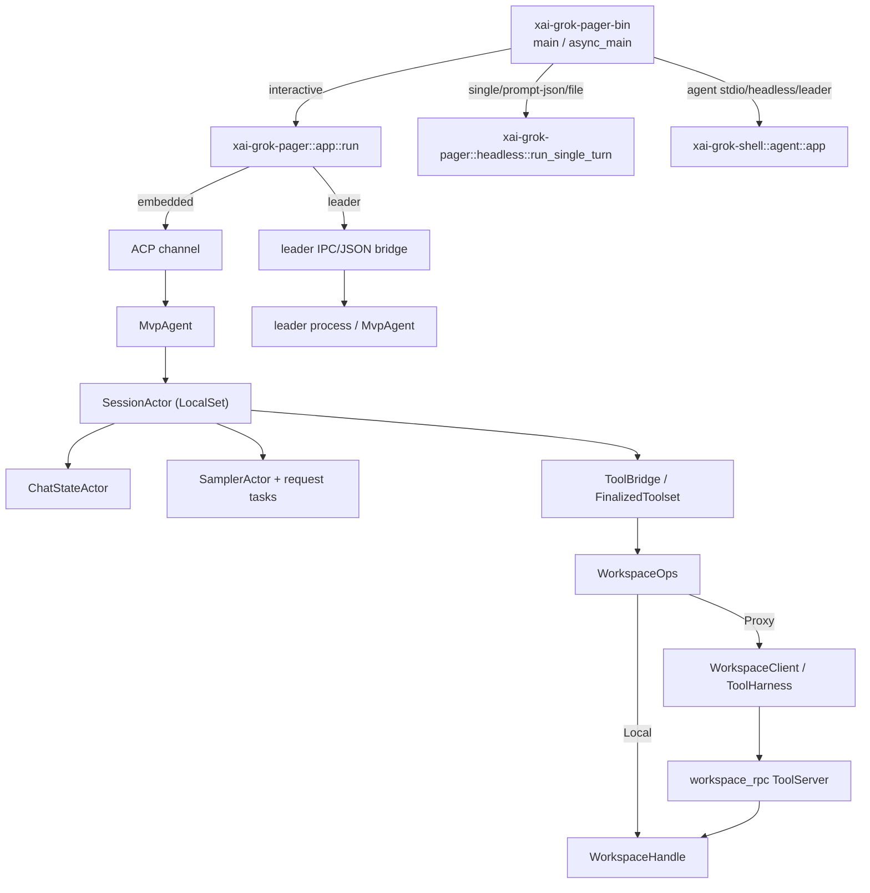

# Grok Build 架构总览

> 本章基于仓库 `SOURCE_REV` 所记录的源码快照，重点说明运行时边界、crate 分层和主要调用链。源码行号用于复核；源码演进后应以符号名为准。

## 一句话定位

Grok Build 是一个以 Rust 编写的终端 coding agent。`xai-grok-pager-bin` 是组合根（composition root），根据命令行把请求分到 TUI、headless、stdio ACP 或 leader；`xai-grok-shell` 持有 agent/session 运行时；`xai-grok-tools` 与 `xai-grok-workspace` 把模型的工具调用落到本地或远程工作区。ACP 是客户端与 agent 的主消息协议，Computer Hub 的 `ToolHarness`/`workspace_rpc` 是远程工作区的传输协议。

## crate 分层与依赖方向

| 层 | 主要 crate | 职责与边界 |
| --- | --- | --- |
| 组合根/CLI | `crates/codegen/xai-grok-pager-bin` | 解析 `PagerArgs`，安装版本、崩溃、telemetry、jemalloc 和 minimal hooks；选择命令、启动 Tokio runtime。该包只负责组装，应用逻辑在 pager 库。 |
| 交互呈现 | `xai-grok-pager`、`xai-grok-pager-render`、`xai-grok-pager-diff`、`xai-grok-pager-minimal` | ratatui/crossterm 绘制、输入/滚动/模态框、markdown/Mermaid、PTY wrapper。pager 通过 ACP channel 消费 agent 事件，不直接实现采样或工具。 |
| Agent 外壳 | `xai-grok-shell`、`xai-grok-agent` | ACP server、认证/config、leader/stdio/headless 入口、`MvpAgent`、session 注册及 hooks/MCP/skills。`xai-grok-agent` 提供 prompt、agent definition 和插件发现等较稳定的领域对象。 |
| 会话状态与推理 | `xai-chat-state`、`xai-grok-sampler`、`xai-grok-sampling-types`、`xai-grok-compaction` | ChatStateActor 顺序维护 conversation/usage/persistence；SamplerActor 管理 HTTP 流、重试、取消；compaction 负责上下文压缩。它们通过 handle/event channel 与 SessionActor 解耦。 |
| 工具运行时 | `xai-grok-tools`、`xai-grok-tools-api`、`xai-tool-runtime`/`xai-tool-protocol`/`xai-tool-types` | 工具注册、schema、资源、progress/terminal stream、取消及 MCP adapter。`FinalizedToolset` 是一次会话可见的不可变目录，资源可在 turn 边界更新。 |
| 工作区 | `xai-grok-workspace`、`xai-grok-workspace-types`、`xai-grok-workspace-client`、`xai-grok-workspace-daemon` | 文件系统、Git/JJ、权限、信任、hunk/checkpoint、worktree、Hub server；types 是 wire contract，client 是远端 RPC 客户端，daemon 只负责服务器进程生命周期。 |
| 横切/叶子 | `xai-grok-config`、`xai-grok-auth`、`xai-grok-telemetry`、`xai-grok-sandbox`、`xai-acp-lib`、`xai-grok-http` 等 | 配置合并、凭证刷新、sandbox policy、ACP framing、HTTP client 和观测。`crates/common`、`prod/mc` 和 `third_party` 是共享叶子/ vendored 依赖。 |

根 `Cargo.toml` 明确写着 “Auto-generated workspace root”，并集中列出 workspace 成员、版本、profiles 和 lints（文件开头注释及 `[workspace]`）。README 也要求按 crate 编辑 manifest，而不是修改根清单（`README.md:72-75`）。这意味着依赖方向应通过各 crate 的 `Cargo.toml` 维护；根文件不应作为手工配置入口。

## 进程与调用图

### 启动主线

1. `xai-grok-pager-bin/src/main.rs:1906` 的 `main` 设置完整版本和启动 telemetry，先处理 Mermaid/voice 子进程、`--version`/`doctor` 快路；随后安装 minimal、崩溃处理、内存观测，建立带 blocking pool 的多线程 Tokio runtime。
2. `main.rs:2003` 的 `async_main` 应用 cwd、sandbox、trust 和 client identity，分流所有管理命令。带 `-p/--single/--prompt-file/--prompt-json` 的请求进入 headless；其余交给 `xai_grok_pager::app::run`。
3. TUI `app/mod.rs:612` 读取有效配置，预取远端 settings/models，解析 leader、screen mode、permission mode，物化新建/恢复/fork session，初始化终端和 writer thread。
4. `app/mod.rs:960-999` 用有界预算执行 `connect_via_leader` 或 embedded `connect`；leader 失败且未取消时自动再尝试 embedded。连接成功后把 channel、models、命令目录交给 `app/event_loop.rs:1076`。
5. headless `headless.rs:762` 不初始化 TUI：配置 agent、spawn embedded shell、ACP initialize/auth、物化 session、按 output format 驱动 prompt，并在可选的后台任务等待后退出。

## 一次 turn 的数据流

用户输入首先成为 ACP `PromptRequest`，`MvpAgent::prompt`（`xai-grok-shell/src/agent/mvp_agent/acp_agent.rs:992-1022`）取得 session handle；SessionActor 将输入放入有序队列。`notification_drain.rs:119` 的 `maybe_start_running_task` 只在没有运行 turn、没有 finalization/edit hold 时提升队首，避免并发修改 conversation。

`turn_task.rs:245-252,378-400` 为每个提升的输入创建带 epoch/identity 的 `AgentTask`；`run_task` 在 `445-465` 调用 session 的 turn handler，再把 completion message 投回 actor。`turn.rs:2293-2337` 的 `process_conversation_turn` 准备工具定义、记录 turn timing，构造模型请求；`turn.rs:2652-2664` 调用 `run_turn_via_sampler`。Sampler 层将 raw HTTP stream 转成 `SamplingEvent`，处理重试/取消/doom-loop，再把事件交给 turn 的 drain。工具调用经过 `ToolBridge`（`xai-grok-tools/src/bridge.rs:61-72,204-214`）和 `FinalizedToolset`，结果同时写回 ChatStateActor、持久化层和 ACP event stream。

`xai-chat-state` 的 actor 注释和 `actor/mod.rs` 明确说明：它在独立 Tokio task 中独占 conversation、sampling config、prompt index、token usage 与 persistence（`xai-chat-state/src/lib.rs:1-31`、`actor/mod.rs:38-100`）。因此 SessionActor 不需要以锁保护整段历史，只通过 handle/query/command 与其交互；这也是 compaction、重放和 usage 统计的单一写入点。

## 并发与生命周期模型

- 组合根使用 Tokio multi-thread；嵌入式 shell 在 `LocalSet`/独立 agent 线程中运行（`xai-grok-shell/src/agent/app.rs:274-303`），以容纳 `MvpAgent`/SessionActor 的 `!Send` 状态。
- SessionActor 的 command、chat-state event、session event、turn completion 在一个 select loop（`run_loop.rs:258-267,421-430`）中串行化；turn 的长耗时工作由局部 task 承担，completion 再回 actor。
- ChatStateActor 是普通 Tokio task；SamplerActor 自身逐命令处理，但每个请求进入 `JoinSet`，所以多个采样请求可并行（`xai-grok-sampler/src/actor/mod.rs:1-8,30-108`）。
- TUI 绘制由 writer thread 与 event loop 分离（`app/mod.rs:903-917`）；配置/skills/MCP/fs watchers 是独立任务，退出时由 cancellation token、`AgentShutdownGuard`、terminal restore 和 workspace teardown 协同收敛。

这种设计把“状态顺序性”和“IO 并发性”分开：conversation/queue/permission decision 需要顺序，HTTP、文件遍历、Git 查询和渲染写出可并发。新增异步工作应避免直接跨越 actor 的所有权边界；优先增加 command/event 或 handle 方法。

## 运行模式矩阵

| 模式 | 入口 | agent 所在位置 | 输出/连接 | 典型用途 |
| --- | --- | --- | --- | --- |
| 交互 TUI | pager-bin → `app::run` | embedded 或 leader | ratatui 终端；ACP typed channel | 日常 coding、会话恢复、dashboard |
| Headless 单 turn | pager-bin → `run_single_turn` | 当前进程内 embedded | stdout emitter（plain/json/streaming JSON） | CI、脚本、结构化消费 |
| `agent stdio` | shell `run_stdio_agent`（`app.rs:230`） | 独立 agent 进程 | stdin/stdout ACP | 编辑器或外部 ACP host |
| `agent headless` | shell `run_headless`（`app.rs:311`） | 独立 agent + grok.com relay | relay WebSocket/ACP | 无 TUI 的远程会话 |
| leader | shell `run_leader`（`app.rs:704`） | 长驻 leader | Unix socket IPC，可选 relay/WS | 多客户端共享 agent、降低启动成本 |
| 远程 workspace | `WorkspaceOps::Proxy` | workspace server sandbox | Hub `ToolHarness` + typed `workspace.*` RPC | 隔离文件/执行环境 |

## 关键契约与演进边界

1. **ACP**：pager 和 shell 只交换 typed request/response/notification；leader bridge 只负责把 raw JSON IPC 转成同一 typed pair，故客户端 UI 不必知道 agent 是 embedded 还是 leader。
2. **工具 stream**：`ToolStream` 有 progress 与 terminal 两类 item；调用方必须消费到 terminal，不能把中间 progress 当最终结果。
3. **Workspace RPC**：`xai-grok-workspace-types` 中每个 request 实现 `WorkspaceRpc`（method + Response），`WorkspaceOps::dispatch` 在 Local 直接 `execute`、Proxy 序列化并走 server。修改字段会同时影响两端，编译器可捕获多数不一致。
4. **配置/feature**：`sandbox-enforce`、`local-workspace`、`test-support`、`jemalloc` 等 feature 改变依赖与行为；发布构建和 Bazel 构建使用的 feature 集合不同，不能只验证默认 debug。
5. **生成/发布**：`pager-bin/build.rs` 注入 `VERSION_WITH_COMMIT`；shell/tools build script 在 release 可打包 rg/fd/bfs/ugrep；`xai-proto-build` 负责 tonic/prost/protoc。源码审阅或迁移构建系统时必须保留这些生成与校验步骤。

## 读代码建议

从一条完整路径入手最省时：`main.rs:1906` → `async_main:2003` → `app::run:612` 或 `headless::run_single_turn:762` → `acp::connect:168`/`connect_via_leader:271` → `MvpAgent::prompt:998` → `SessionActor::run_session:258` → `process_conversation_turn:2293` → `run_turn_via_sampler:1588` → `WorkspaceOps`/`ToolBridge`。呈现问题优先看 pager 的 event loop/render；模型/重试问题看 sampler；权限、路径或 VCS 问题看 workspace，而不要在组合根里追实现。
