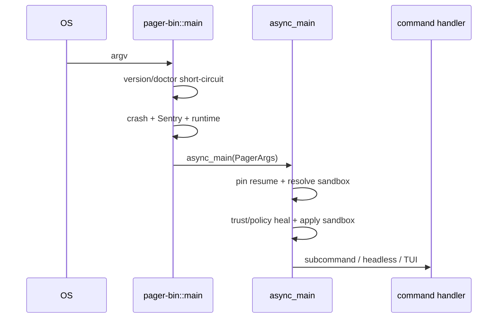

# 第二章：启动顺序与 CLI 分流

## 结论

启动器刻意把“会改变进程边界或安全语义的动作”放在业务命令前：版本/doctor 先短路，
然后初始化 allocator、崩溃处理、Sentry 与 Tokio，进入 `async_main` 后先解析 resume 与
sandbox，再做 trust/policy heal，最后才创建 agent 或 TUI。这个顺序避免了在错误的
隔离策略下读取会话，也让无需运行 agent 的命令快速返回。

## `main()` 的同步阶段

`crates/codegen/xai-grok-pager-bin/src/main.rs:1906` 是唯一的二进制入口。主要阶段如下：

1. 写入完整版本和进程启动时间（1907–1908）。Mermaid/voice 子进程在 1909–1914 快路
   直接退出，避免递归进入完整初始化。
2. `PagerArgs::parse_cli()`（1918）解析命令；`version` 与 `doctor` 在 1919–1921
   直接处理，不创建 Tokio 或读取用户配置。
3. 1922 起安装 minimal hooks、检查 requirements、初始化 Sentry（1946–1951）、崩溃
   handler（1953–1972）和 crashed-session 探测（1973–1979）。
4. 1980–1988 创建多线程 Tokio runtime，并将 `async_main(args)` 交给统一 shutdown
   包装；错误路径在 1990–2000 恢复 stderr、flush telemetry 后退出。

## `async_main()` 的安全前置区

`main.rs:2003` 开始的前置区有几个容易被忽略的设计点：

- 2004–2029 应用 CA、cwd、debug/compaction 环境变量和 leader socket。
- 2042 先调用 `pin_local_resume_target()`；2043–2053 把 session 保存的 sandbox profile
  与显式 `--sandbox` 比较，不一致就拒绝恢复。这样不可逆 sandbox 发生前，resume 目标和
  隔离策略已经确定。
- 2055–2061 处理 `--trust`；2063–2082 对需要 managed policy 的命令做磁盘配置 heal。
- 2084–2088 才调用 `apply_sandbox`。此调用之后不能再切换 profile。
- 2090–2100 区分 interactive 与 generic client，设置权限客户端类型和请求 identity。

恢复相关 CLI 的实现集中在
`crates/codegen/xai-grok-pager/src/app/cli.rs:939`（profile 解析）和
`cli.rs:949`（presandbox pin）。

## 命令分流矩阵

`main.rs:2103` 的 `match command` 覆盖以下控制面：

| 分支 | 处理者 | 语义 |
|---|---|---|
| `agent` | `run_agent_command` | stdio ACP、headless relay、WebSocket serve、leader |
| `inspect/setup` | shell/pager inspect/setup | 只读诊断或配置初始化 |
| `mcp/plugin/models` | pager 命令模块 | 扩展与模型控制面 |
| `leader/worktree/workspace` | leader/worktree 管理 | 进程协作、隔离 checkout、workspace server |
| `sessions/usage/share/export/trace` | 对应 pager 命令 | 本地会话、计费/共享/导出/调试产物 |
| `memory/update/login/logout` | memory/update/auth | 跨会话记忆、升级、认证 |

具体分支从 `main.rs:2120`（agent）到 `main.rs:2278`；每个需要异步网络的控制面命令
独立安装 tracing/OTel guard，不把 TUI 生命周期耦合进来。

## Headless 与默认 TUI

命令分流结束后，`main.rs:2288` 附近检查 `-p/--single`、JSON prompt、prompt file 和
memory flush；headless 路径调用单轮执行并按 `OutputFormat` 输出。没有这些标志时，
`main.rs:2365` 以后启动后台更新检查，再调用 `xai_grok_pager::app::run()`（约 2386）。

CLI 参数本身在 `crates/codegen/xai-grok-pager/src/app/cli.rs:421` 定义：

- 输入：`--single`、`--prompt-json`、`--prompt-file`（473–499）；
- 恢复：`--resume/-r`、`--continue/-c`、`--fork-session`（545–588）；
- 工作区与安全：`--worktree`、`--restore-code`、`--permission-mode`、`--sandbox`
  （589–708）；
- 扩展与编排：`--agent`、`--agents`、`--tools`、`--no-subagents`、`--memory-flush`
  （631–666）；
- 输出与等待：`--output-format`、`--json-schema`、`--background-wait-timeout`
  （503–514、687–705）；
- 屏幕：`--minimal`/`--fullscreen`（739–753）。

## 关键取舍

“先 pin、后 sandbox”意味着启动阶段要读少量 session metadata；这是必要的 TOCTOU 防护。
代价是损坏或权限异常的 session 会在进入 TUI 前失败。另一方面，版本/doctor 的早退出和
各命令独立 telemetry guard 让诊断命令不会被 agent 初始化拖慢。
