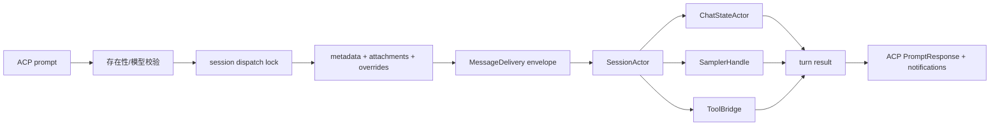

# 第三章：Agent loop 与 ACP

## 结论

ACP 是外部客户端的稳定边界，session actor 才是内部状态机。`MvpAgent` 不直接执行工具，
而是完成“校验请求 → 构造 prompt metadata → 投递到 session → 等待 turn → 汇总事件与上传”
的适配；这样 TUI、stdio ACP、headless relay、leader 都复用同一 session 实现。

## 进程与连接建立

`crates/codegen/xai-grok-shell/src/agent/app.rs:138`–`165` 创建 `MvpAgent` 并接入
ACP `AgentSideConnection`。同文件 173–221 建立 skills/workflows 文件监听器：文件变化
不会在任意线程直接改 prompt，而是向 ACP 输入流注入内部 reload 消息，保持状态更新顺序。

`run_stdio_agent()` 位于 `app.rs:230`–`308`，做四类启动工作：

- 父进程死亡绑定和孤儿上传清理；
- stdin/stdout ACP transport；
- auth manager、proactive refresh、managed config；
- OTel context 和 Tokio `LocalSet` 中的 agent 生命周期。

因此 stdio agent 既可被 IDE 拉起，也可在 headless/leader 中作为子进程；网络认证和本地
状态的初始化只有一个实现。

## `prompt()` 的前置检查与串行化

`crates/codegen/xai-grok-shell/src/agent/mvp_agent/acp_agent.rs:998`–`1110` 先验证
session 存在、模型 allowlist 和“已下线模型”的恢复策略。1111–1145 随后按 session 获取
dispatch lock，分配 turn number、prompt id 和 trace context。这个锁是关键不变量：同一
session 的两个 ACP prompt 不会同时重写 conversation 或竞争 tool override；不同 session
仍可并行。

## Prompt 到 session actor 的路径

1167–1279 构造 prompt metadata、session state、图片和 plugin 状态并上传；1302–1403 读取
meta/schema/tool overrides，决定当前请求是 `send_now`（中断/重定向）还是排队。投递使用
message-delivery envelope，而不是直接调用 sampler，因此取消、权限等待和后台任务都能在
同一个 mailbox 中排序。

## 等待与结果汇总

`acp_agent.rs:1409`–`1522` 等待 session actor 的 oneshot 结果，更新 roster activity，
处理 removed-from-queue、取消类别和 prompt-complete 通知。`1548` 以后将结果拆为：

- stop reason、token usage、turn snapshot；
- subagent 引用与 permission events；
- streaming partial（取消或非 completed turn 也能上传）；
- harness trace / session state upload。

`acp_agent.rs:1627` 附近的 `TurnResultMetadata` 把输入/缓存/输出 token、resolved model、
signals、prompt mode 和 subagents 一起写入上传任务；上传可按 deadline defer，也可后台
spawn，避免阻塞用户看到最终回复。

## Session actor 的职责边界

`xai-grok-shell/src/session/` 目录把状态拆成多个子系统：`acp_session.rs` 负责 ACP 转换，
`commands.rs` 定义 mailbox，`chat_persistence.rs`/`persistence.rs` 管 transcript，
`compaction.rs` 管上下文替换，`mcp_dispatcher.rs` 管 MCP，`message_delivery.rs` 管排队和
重定向，`goal_*` 管长期任务判定。`xai-chat-state/src/lib.rs:1` 的注释给出独立
`ChatStateActor` 结构：专用 Tokio task 内拥有 conversation、sampling config、prompt index
和 token 总量，无需跨线程锁。

## 取舍与失败模式

- ACP 层对外暴露丰富事件，但最终 `PromptResponse` 仍保持协议兼容；未知扩展事件可被丢弃，
  核心 turn 结果不会丢。
- session lock 降低同一会话并发吞吐，却换来 transcript 和 usage 的线性一致性。
- 上传是 best-effort：网络/进程退出可能丢 telemetry 或 trace，但本地 session transcript
  已在 actor/persistence 路径中独立保存。
