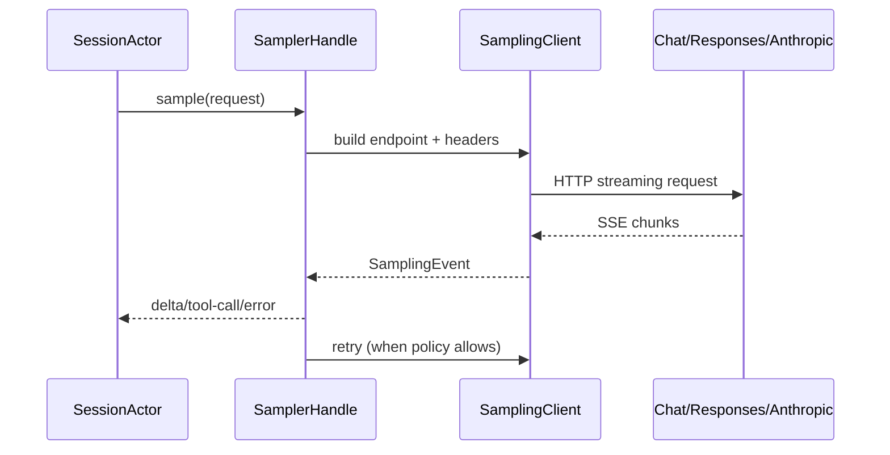

# 第五章：Sampling、SSE 与模型 API

## 结论

采样层把网络细节从 session actor 中抽离为三层 API：`SamplingClient` 负责 HTTP，stream
适配器把 SSE 变成统一 `SamplingEvent`，`SamplerHandle/Actor` 负责重试、取消和并发协调。
客户端同时兼容 Chat Completions、Responses 和 Anthropic Messages 三种后端形状，并在
边界处修正 xAI 特有字段，避免上层被某一种 API 绑死。

## 三层结构

`crates/codegen/xai-grok-sampler/src/lib.rs:1`–`10` 明确分层：

1. raw chunk stream；
2. `stream` 模块把 chunk 转为 `SamplingEvent`；
3. actor-based `SamplerHandle` 处理 retry/cancel/coordination。

公开模块还包括 `retry`、`doom_loop`、`metrics`、`attribution` 和 `sampling_log`
（12–29、31–56）。session 因此只关心“开始一次采样、接收事件、提交结果”，不处理 SSE
解析或指数退避。

## 请求后端与身份头

`crates/codegen/xai-grok-sampler/src/client.rs:1`–`12` 列出三种 endpoint：
`/chat/completions`、`/responses`、`/messages`。52–86 的 `GrokRequestHeaders` 为每次
请求注入：

`x-grok-conv-id`、`x-grok-req-id`、`x-grok-model-override`、`x-grok-session-id`、
`x-grok-agent-id`，以及可选 turn index、transient retry、deployment id、user id。

这些头把一次网络请求和本地 session/turn 关联起来，既支持服务端计量，也让 401 attribution
知道是哪个 credential snapshot 失败；但它们也意味着 session id/user id 属于潜在外传
元数据，需与 telemetry 策略一起审查。

`SamplingClient` 结构在 `client.rs:304`–`323`：持有可 clone 的 reqwest client、默认头、
endpoint template、auth scheme、bearer resolver、OTel header injector 和 401 callback。
URL query 在 352–414 统一折叠，避免不同调用路径产生重复参数。

## Responses SSE 的兼容修正

`client.rs:90`–`120` 反序列化 Responses SSE；遇到 async-openai 不认识的工具（如
`x_search`）时，先把 JSON 解析为 Value，逐项尝试 typed decode，无法解析的工具丢弃后再
重试。这个策略保留主事件流，同时避免维护脆弱的硬编码 allowlist。

`client.rs:122`–`165` 在 terminal `response.completed/incomplete` 事件上读取
`usage.context_details.input_tokens + output_tokens`，覆盖 typed `total_tokens`。原因是
服务端 hosted tool loop 的累计 token 会膨胀；修正后的值驱动 `/context`、auto-compaction
阈值和 session `meta.totalTokens`，而 billing 字段保持原始累计值。

## 重试与错误归类

`retry` 模块公开默认最大重试、最大 backoff、`Retry-After` 解析和 `x-should-retry` 判定
（`lib.rs:49`–`52`；`client.rs:186`–`208`）。网络层把 401 单独送入 attribution callback，
按“旧 snapshot / live token rejected”分类（`client.rs:312`–`315`）。非可重试的模型、参数
和权限错误不会被盲目重放，避免重复工具副作用。

## 流到 session 的时序

## 取消、doom loop 与观测

采样 actor 以 cancellation token 贯穿 request、stream 和 retry；`doom_loop` 模块检测模型
反复输出相同工具/文本的异常循环，并把恢复尝试作为结构化事件。`metrics` 计算 TTFT、TTLB、
重试次数和 token percentiles；`prompt_timing` 在 telemetry 层再汇总 tool prep、repo status
和 model result。

## 设计取舍

- 兼容三种 API 增加类型适配成本，但允许企业 proxy、Anthropic 兼容端点和 xAI Responses
  共用一套 agent。
- 在 client 层丢弃未知 hosted tool 是“可用性优先”的降级；若未知工具本来是任务必需能力，
  上层会看到缺少工具而非序列化崩溃。
- `SamplingClient` 不负责 trace upload 或 URL header 注入（文件头部注释明确说明），
  将隐私/部署策略留给 session 配置，降低网络层的隐式副作用。
