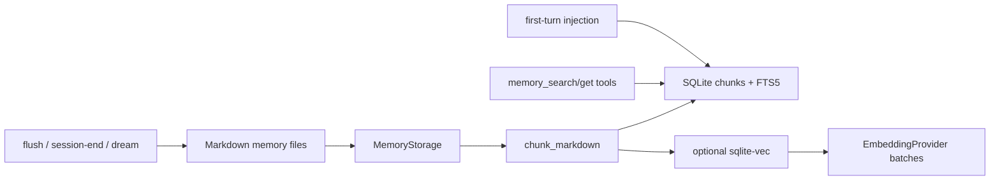
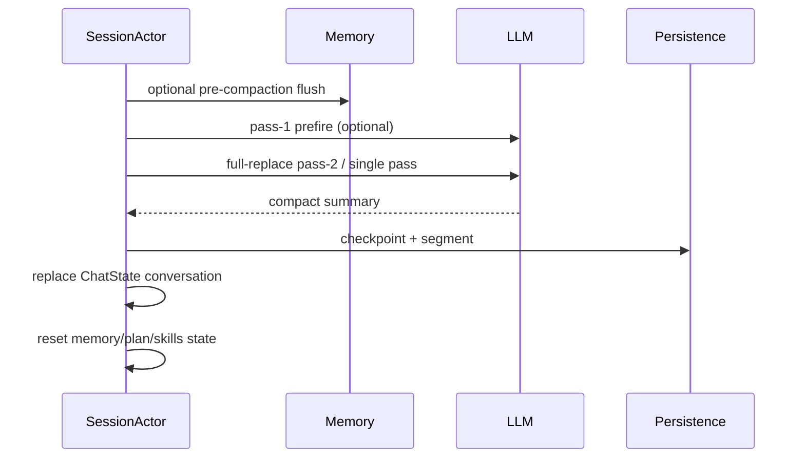

# 第七章：Memory、Embedding 与 Compaction

## 结论

Grok Build 的 memory 与 session transcript 是两条不同的数据平面：session 负责可重放的
当前对话，memory 负责跨 session 的 Markdown 知识与搜索索引。memory 的写入是“文件先行、
索引随后”：写入 global/workspace/session Markdown 后立即 reindex，并尽力补齐 embedding。
索引使用 SQLite FTS5，若 sqlite-vec 可用再加 KNN；向量扩展不可用时自动降级为 FTS-only，
不会阻塞会话。

Compaction 则是对当前 `ChatStateActor` conversation 的 full-replace。它可在压缩前触发
memory flush，可选 two-pass 预热早期历史，随后以多级输入降级完成摘要，持久化 checkpoint
与 segment，再原子替换对话并重置需要重新计算的状态。自动压缩失败有细分 suppression 状态；
手动 `/compact` 不被这些自动门控拦截。

## Memory 数据布局与索引

`xai-grok-memory` 模块注释定义了布局：`~/.grok/memory/MEMORY.md` 是全局记忆，按
`blake3(cwd)[..16]` 的 workspace hash 目录保存 workspace `MEMORY.md`，每个 session 的
日志位于 `sessions/YYYY-MM-DD-{slug}-{sid8}.md`（[`memory/lib.rs:1-19`](/home/qiqiang/opensource/grok-build/crates/codegen/xai-grok-memory/src/lib.rs:1)）。
memory 由 `GROK_MEMORY`、`[memory] enabled` 或远端 settings 打开；关闭时 host 不初始化
该 crate。

`MemoryIndex` 是 SQLite-backed index：`chunks` 保存分块元数据，contentless FTS5 表做
BM25 关键词检索，可选 `chunks_vec` 做向量相似度（[`memory/index.rs:1-11`](/home/qiqiang/opensource/grok-build/crates/codegen/xai-grok-memory/src/index.rs:1)）。
打开数据库时会记录 embedding dimensions；检测不到 sqlite-vec 就记录 warning 并保留
FTS 功能，维度变化会重建向量表（[`index.rs:91-191`](/home/qiqiang/opensource/grok-build/crates/codegen/xai-grok-memory/src/index.rs:91)）。
单文件 reindex 将 Markdown chunk 化、按 hash 比较增删改，并把 chunks、FTS 与向量旧记录
放在一个 SQLite transaction 中，避免索引三部分出现半更新
（[`index.rs:214-343`](/home/qiqiang/opensource/grok-build/crates/codegen/xai-grok-memory/src/index.rs:214)）。

缺失 embedding 的 chunk 以最多 32 条一批送给 `EmbeddingProvider`；单批失败会跳过并记录
warning，已写入的文本索引仍可用（[`memory/lib.rs:45-109`](/home/qiqiang/opensource/grok-build/crates/codegen/xai-grok-memory/src/lib.rs:45)）。
这意味着“有记忆文本”不等于“已有向量”，搜索实现必须保留 FTS/降级路径。

## Session 初始化与工具暴露

session actor 创建时，若 memory enabled，会建立 `MemoryStorage`、执行初始化与后台 GC，
按配置启动文件 watcher，构造 `MemoryBackendParams`（搜索、embedding、凭据、session id），
然后把 backend 放入 tool resources；这些步骤以及失败后继续启动的行为见
[`acp_session_impl/spawn.rs:776-915`](/home/qiqiang/opensource/grok-build/crates/codegen/xai-grok-shell/src/session/acp_session_impl/spawn.rs:776)。
`memory_search`/`memory_get` 不是静态硬编码到每个 agent 的特殊分支，而是通过
`ToolBridge::register_mcp_tools` 动态注册；`/memory on` 可再次执行注册
（[`memory_dream.rs:43-74`](/home/qiqiang/opensource/grok-build/crates/codegen/xai-grok-shell/src/session/acp_session_impl/memory_dream.rs:43)）。

## 三种写入路径

### Session-end save

session 结束时读取当前 conversation，调用 `on_session_end`；只有真正写出 session log 才
reindex/embed 并发送 `MemorySessionSaved`，subagent session 明确跳过该 pipeline
（[`memory_dream.rs:103-167`](/home/qiqiang/opensource/grok-build/crates/codegen/xai-grok-shell/src/session/acp_session_impl/memory_dream.rs:103)）。
因此子 agent 不会把中间草稿自动污染全局记忆；这是源码事实，不是对所有插件脚本的约束。

### Memory flush

flush 由一个原子 lock 串行化；idle timer、pre-compaction 和用户命令同时到达时，后来的
调用直接跳过。它取得最多最近 20 条消息，重复 flush 使用上次内容组成 delta prompt，
再用指定模型生成摘要（[`memory_dream.rs:504-630`](/home/qiqiang/opensource/grok-build/crates/codegen/xai-grok-shell/src/session/acp_session_impl/memory_dream.rs:504)）。
响应经过结构化截断/拒绝处理；写入 daily log 前先做语义去重，接受后立即 reindex/embed，
并缓存本次内容。写失败、模型失败或被拒绝只记录 telemetry，释放 lock；注释明确指出
flush failure non-fatal，compaction 仍继续（[`memory_dream.rs:632-787`](/home/qiqiang/opensource/grok-build/crates/codegen/xai-grok-shell/src/session/acp_session_impl/memory_dream.rs:632)）。

### Dream consolidation

dream 是跨 session 的 consolidation，不应与每次 flush 混淆。执行前取得文件锁，并在锁内
再次检查 gate，防止两个等待者基于旧快照重复合并；模型调用有 30 分钟 timeout
（[`memory_dream.rs:292-399`](/home/qiqiang/opensource/grok-build/crates/codegen/xai-grok-shell/src/session/acp_session_impl/memory_dream.rs:292)）。
完成后先写 workspace memory、reindex/embed、清理已经处理的 session logs，最后才 commit
marker；marker 写不成功则不宣称成功、保持 gate 可重试（[`memory_dream.rs:399-449`](/home/qiqiang/opensource/grok-build/crates/codegen/xai-grok-shell/src/session/acp_session_impl/memory_dream.rs:399)）。
这是一条“最后提交”不变量，避免清理动作先发生却留下已完成标记的不可恢复状态。

## First-turn memory injection

首次 turn 使用一次性 `context_injected` gate；memory disabled、backend/storage 不存在时
直接跳过。若 conversation 已有 `<memory-context>` block（例如 resume 或此前 compaction），
代码原样复用并跳过重搜，以保护 prompt cache（[`turn.rs:1987-2038`](/home/qiqiang/opensource/grok-build/crates/codegen/xai-grok-shell/src/session/acp_session_impl/turn.rs:1987)）。
普通首问使用用户文本查询；greeting 使用较宽的“project conventions preferences architecture”
查询，最多取 6 条，并过滤格式化后为 `0.00` 的分数，再由 helper 生成 reminder
（[`turn.rs:2040-2117`](/home/qiqiang/opensource/grok-build/crates/codegen/xai-grok-shell/src/session/acp_session_impl/turn.rs:2040)）。
注入是 system reminder，不会把搜索结果伪装成用户历史消息。

## Compaction policy 与模式

默认策略是 context 使用率 85% 触发自动压缩、memory flush 关闭、wall-clock budget 300 秒、
two-pass 关闭（[`xai-grok-agent/src/compaction.rs:1-35`](/home/qiqiang/opensource/grok-build/crates/codegen/xai-grok-agent/src/compaction.rs:1)）。
模式定义在 `xai-chat-state`：`Summary` 只保留摘要，`Transcript` 在摘要中指向完整
`updates.jsonl`，`Segments(detail)` 指向 `compaction/segment_*.md` 与 `INDEX.md`，默认是
Segments；提示明确要求用 read/grep 读取且不要修改 segment 文件
（[`compaction_mode.rs:7-82`](/home/qiqiang/opensource/grok-build/crates/codegen/xai-chat-state/src/compaction_mode.rs:7)）。

自动压缩 suppression 分为 turn、sticky、credit-success、auth 等状态；manual `/compact`
绕过 suppression。cancel gate 是 holder-count 设计，prefire 与 compact 重叠时共享取消 token；
prefire 采用 single-flight cache，模型切换、rewind 或编辑会清除 cache
（[`compaction_config.rs:12-183`](/home/qiqiang/opensource/grok-build/crates/codegen/xai-grok-shell/src/session/compaction_config.rs:12)）。

## Two-pass 与 full-replace 链路

当使用率接近阈值（阈值减 lead，默认约 10 个百分点）时，后台 pass-1 总结 conversation
prefix，缓存 NOTE₁、prefix 长度、fingerprint 与模型 slug；真正 compact 时 pass-2 将 NOTE₁
与最近 tail 一起生成最终摘要。fingerprint/model 不匹配就丢弃 cache，避免把过期前缀拼进
新对话（[`compaction.rs:134-318`](/home/qiqiang/opensource/grok-build/crates/codegen/xai-grok-shell/src/session/compaction.rs:134)）。

full-replace sampler 的输入级别是 verbatim → fitted verbatim → lossy。超出模型上下文、
确定性 schema/degenerate 错误和 transient 网络错误分别计数；只有适合重试的类别才推进到
下一输入级别，最终失败会返回可分类的 ACP error，而不是静默清空 conversation
（[`compaction.rs:1039-1120`](/home/qiqiang/opensource/grok-build/crates/codegen/xai-grok-shell/src/session/compaction.rs:1039)；[`compaction.rs:1293-1323`](/home/qiqiang/opensource/grok-build/crates/codegen/xai-grok-shell/src/session/compaction.rs:1293)）。

## 应用压缩结果与可恢复制品

压缩成功后，actor 构造带 system/user prefix、当前状态、工具/任务/MCP/workflow reminder
和 transcript hint 的新 history；先清理孤立 `ToolResult`，若仍违反配对约束则退回不带
recent messages 的最小 history。随后记录 compaction index，写 checkpoint，按模式排队
segment，并调用 `replace_conversation_for_compaction`（[`compaction.rs:1707-1806`](/home/qiqiang/opensource/grok-build/crates/codegen/xai-grok-shell/src/session/compaction.rs:1707)）。
fork 继承的 prefix 若重新 pin 会再次超过阈值，就释放 prefix、设置 sticky 标记，避免
下一轮自动压缩循环；否则保留 inherited prefix（[`compaction.rs:803-861`](/home/qiqiang/opensource/grok-build/crates/codegen/xai-grok-shell/src/session/compaction.rs:803)）。

替换后会清零 memory injection gate、重置 plan mode、通知 ToolBridge 重新处理 AGENTS.md 与
skills，并触发 `PostCompact` hook（[`compaction.rs:1804-1868`](/home/qiqiang/opensource/grok-build/crates/codegen/xai-grok-shell/src/session/compaction.rs:1804)）。
这说明 compaction 不只是“删旧消息”，而是一次 prompt context 重新构造与插件状态再绑定。

## Token 观测与 `/context`

session context snapshot 调用 xAI `/tokenize-text`，并行统计 system、tool definitions、
skills、MCP、AGENTS.md、workflows；源码特别注明不是 bytes/4 heuristic
（[`context_snapshot.rs:1-53`](/home/qiqiang/opensource/grok-build/crates/codegen/xai-grok-shell/src/session/acp_session_impl/context_snapshot.rs:1)）。
`build_session_info` 同时返回 used/total/free/usage percentage、消息/工具数量、compaction
计数及各类别 token（[`session_setup.rs:582-700`](/home/qiqiang/opensource/grok-build/crates/codegen/xai-grok-shell/src/session/acp_session_impl/session_setup.rs:582)）。
因此 `/context` 的数字是模型 tokenizer/估算器的运行时观测，不应从文件字节数推导。

## 风险与边界

- memory 文本与 embedding 是两阶段；embedding 服务故障不会撤销已写 Markdown，但会使向量
  检索暂时退化。
- flush、dream 都调用模型并可能写入用户内容；权限、凭据和 telemetry 脱敏由其他层负责，
  本章代码不构成隐私策略。
- compaction summary 是 lossy 表示；`Transcript`/`Segments` 只提供恢复入口，模型是否真的
  读取由 prompt 行为决定，不能声称“压缩后信息零损失”。
- 自动 suppression 会避免失败重试风暴，但 sticky/credit/auth 状态若没有对应的模型切换、
  token refresh 或成功响应，自动压缩可能保持关闭；手动命令仍是人工恢复路径。

## 可验证证据表

| 结论 | 证据 |
|---|---|
| memory 布局与 feature flag | [`memory/lib.rs:1-19`](/home/qiqiang/opensource/grok-build/crates/codegen/xai-grok-memory/src/lib.rs:1) |
| FTS5/向量索引与降级 | [`memory/index.rs:1-11`](/home/qiqiang/opensource/grok-build/crates/codegen/xai-grok-memory/src/index.rs:1)、[`index.rs:127-191`](/home/qiqiang/opensource/grok-build/crates/codegen/xai-grok-memory/src/index.rs:127) |
| session memory 初始化 | [`session/acp_session_impl/spawn.rs:776-915`](/home/qiqiang/opensource/grok-build/crates/codegen/xai-grok-shell/src/session/acp_session_impl/spawn.rs:776) |
| flush lock/20 条窗口/失败非致命 | [`memory_dream.rs:504-630`](/home/qiqiang/opensource/grok-build/crates/codegen/xai-grok-shell/src/session/acp_session_impl/memory_dream.rs:504) |
| dream 二次 gate 与最后 commit | [`memory_dream.rs:292-449`](/home/qiqiang/opensource/grok-build/crates/codegen/xai-grok-shell/src/session/acp_session_impl/memory_dream.rs:292) |
| first-turn injection cache 保护 | [`turn.rs:1987-2117`](/home/qiqiang/opensource/grok-build/crates/codegen/xai-grok-shell/src/session/acp_session_impl/turn.rs:1987) |
| two-pass prefire | [`compaction.rs:134-318`](/home/qiqiang/opensource/grok-build/crates/codegen/xai-grok-shell/src/session/compaction.rs:134) |
| full-replace 与应用结果 | [`compaction.rs:1039-1120`](/home/qiqiang/opensource/grok-build/crates/codegen/xai-grok-shell/src/session/compaction.rs:1039)、[`compaction.rs:1707-1868`](/home/qiqiang/opensource/grok-build/crates/codegen/xai-grok-shell/src/session/compaction.rs:1707) |
| tokenizer-based context snapshot | [`context_snapshot.rs:1-53`](/home/qiqiang/opensource/grok-build/crates/codegen/xai-grok-shell/src/session/acp_session_impl/context_snapshot.rs:1) |
