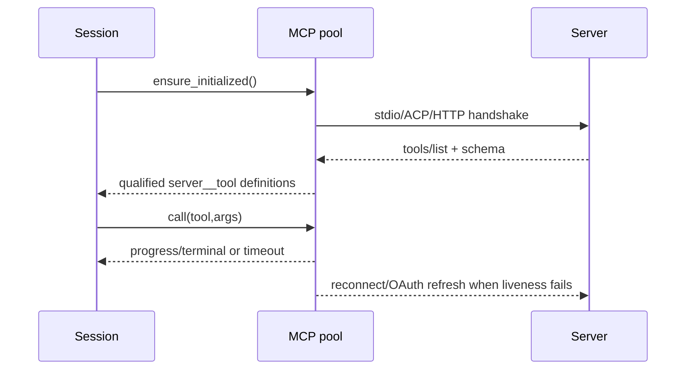
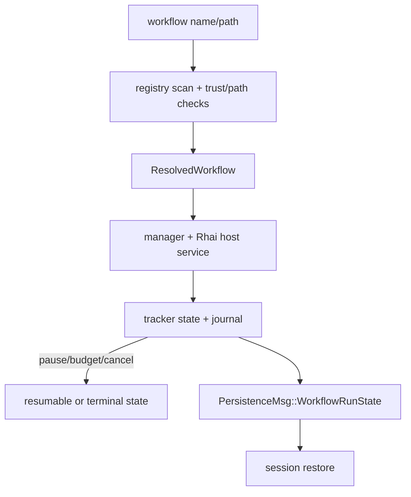

# 第八章：MCP、Skills、Plugins、Hooks 与 Workflow

## 结论

扩展能力在 Grok Build 中分成四个层次，而不是一条“加载脚本”路径：

1. MCP 是带握手、超时、OAuth、重连和工具 schema 的外部服务客户端池；
2. Skills/commands/agents 是 prompt metadata，先发现、解析和列出，再由工具或 agent
   builder 决定是否注入；
3. Plugins 是把 skills、agents、hooks、MCP、LSP 绑定在同一根目录的可启停包，项目插件
   受 trust gate，未信任时仍可列出 metadata，但可执行组件被阻断；
4. Workflow 是经过来源优先级、路径信任和脚本大小限制的 Rhai 程序，运行状态由 session
   tracker/store 持久化，能暂停、恢复和按 agent budget 终止。

这些层共享 tool registry 和 session actor，但安全边界不同：MCP 的 `X-Grok-Agent-ID`
只是路由提示，plugin trust 才是项目可执行内容的 gate；skill 文本本身不等同于可执行权限。

## MCP：从配置到可调用工具

MCP 工具名使用 `server__tool` 限定符，跨 provider 的最终工具名还必须满足“字母/下划线
开头、最多 64 字符、仅字母数字下划线连字符”的正则
（[`servers.rs:47-97`](/home/qiqiang/opensource/grok-build/crates/codegen/xai-grok-mcp/src/servers.rs:47)）。
`X-Grok-Agent-ID` 只用于 first-party local app 路由，代码明确声明它不是认证；用户配置中的
同名 header 会被剥离，只有 spawn context 才重新添加
（[`servers.rs:51-57`](/home/qiqiang/opensource/grok-build/crates/codegen/xai-grok-mcp/src/servers.rs:51)）。

初始化状态是 `NotStarted → Starting{handshaking} → Finished{handshaking}`。`finish_init`
可以先返回，让非 MCP 工作继续；但 `is_complete` 只有全部 per-server handshake settle
才为真，模型第一次工具调用若撞上后台握手会在 `Notify` 上等待，而不是把 race 变成模型可见
错误（[`servers.rs:231-393`](/home/qiqiang/opensource/grok-build/crates/codegen/xai-grok-mcp/src/servers.rs:231)；[`servers.rs:3075-3087`](/home/qiqiang/opensource/grok-build/crates/codegen/xai-grok-mcp/src/servers.rs:3075)）。

支持三种 transport：stdio 子进程、ACP reverse channel、HTTP/HTTP-auth
（[`servers.rs:3535-3591`](/home/qiqiang/opensource/grok-build/crates/codegen/xai-grok-mcp/src/servers.rs:3535)）。
HTTP OAuth client 保存 AuthorizationManager、观察到的 token、可重建 transport 和 liveness
poller；状态替换会唤醒等待者（[`servers.rs:3075-3135`](/home/qiqiang/opensource/grok-build/crates/codegen/xai-grok-mcp/src/servers.rs:3075)；[`servers.rs:3520-3533`](/home/qiqiang/opensource/grok-build/crates/codegen/xai-grok-mcp/src/servers.rs:3520)）。
初始化是 single-flight：并发 caller 共享同一 handshake，startup timeout/OAuth refresh
失败会按策略重试，避免每个工具调用都启动一条新连接。

stdio spawn 会设置受保护的 `GROK_SESSION_ID`，并依据网络限制构建子进程环境；HTTP/SSE
会做 OAuth discovery。代码一次并发启动配置中的全部服务器
（[`servers.rs:4680-4888`](/home/qiqiang/opensource/grok-build/crates/codegen/xai-grok-mcp/src/servers.rs:4680)）。
tools/list 结果先原子落盘 descriptor，再分页读取、补 schema、过滤非法名称，随后才允许
直接 tool call（[`servers.rs:4201-4424`](/home/qiqiang/opensource/grok-build/crates/codegen/xai-grok-mcp/src/servers.rs:4201)）。

## Skills 与 commands

skill discovery 只扫描名为 `skills/` 的目录，递归深度最多 5；`SKILL.md` 可以位于 skill
根或子目录。扫描按字典序，name collision 采用 first-seen-wins，因此结果是确定的
（[`skills/discovery.rs:15-19`](/home/qiqiang/opensource/grok-build/crates/codegen/xai-grok-tools/src/implementations/skills/discovery.rs:15)；[`discovery.rs:68-146`](/home/qiqiang/opensource/grok-build/crates/codegen/xai-grok-tools/src/implementations/skills/discovery.rs:68)）。
解析器限制 frontmatter 4 KiB、name 64 字符、description 1024 字符，并支持
`allowed-tools`、`paths`、metadata 等字段的类型归一化；vendor 默认 skill（如特定
`.cursor`/`.claude` 名称）会被过滤（[`discovery.rs:15-66`](/home/qiqiang/opensource/grok-build/crates/codegen/xai-grok-tools/src/implementations/skills/discovery.rs:15)；[`discovery.rs:148-294`](/home/qiqiang/opensource/grok-build/crates/codegen/xai-grok-tools/src/implementations/skills/discovery.rs:148)）。

agent builder 先发现 skills，再根据 definition 的 explicit `skills` 解析预加载项；预加载
正文会插入 prompt body，之后才构造 tool bridge。默认工具、memory、web、LSP、media、plan
和 task 会按配置 gate，subagent audience 会移除 ask-user，禁用 memory 时会剔除
`memory_search/get`（[`builder.rs:630-773`](/home/qiqiang/opensource/grok-build/crates/codegen/xai-grok-agent/src/builder.rs:630)）。
这条顺序很重要：发现 skill 不代表一定进入当前模型 manifest，最终可见性由 definition、
audience、toggle 和 tool allowlist 决定。

## Plugins：发现、优先级、启用与信任

插件发现顺序是 CLI `--plugin-dir`、项目 `.grok/plugins`/`.claude/plugins`、用户
`$GROK_HOME/plugins`/兼容目录、marketplace installs，最后是 `[plugins].paths`；每个候选
先 canonicalize 去重，再按 scope 解决同名冲突（[`plugins/discovery.rs:1-14`](/home/qiqiang/opensource/grok-build/crates/codegen/xai-grok-agent/src/plugins/discovery.rs:1)；[`discovery.rs:261-428`](/home/qiqiang/opensource/grok-build/crates/codegen/xai-grok-agent/src/plugins/discovery.rs:261)）。
稳定 `PluginId` 是 `<scope>/<sha256(path)前8位>/<name>`，避免仅凭显示名混淆不同根目录
（[`discovery.rs:98-119`](/home/qiqiang/opensource/grok-build/crates/codegen/xai-grok-agent/src/plugins/discovery.rs:98)）。

manifest 首选根目录 `plugin.json`，再查 `.grok-plugin/plugin.json` 与
`.claude-plugin/plugin.json`；没有 manifest 也可按约定发现 skills、agents、`.mcp.json`
和 hooks，未知字段忽略以保持前向兼容。manifest 中的 hooks/MCP/LSP 路径先做 canonical
containment 检查，`..` 越界路径拒绝（[`plugins/manifest.rs:1-10`](/home/qiqiang/opensource/grok-build/crates/codegen/xai-grok-agent/src/plugins/manifest.rs:1)；[`manifest.rs:45-107`](/home/qiqiang/opensource/grok-build/crates/codegen/xai-grok-agent/src/plugins/manifest.rs:45)）。

插件 registry 将 enabled、trusted、组件数量、inline 配置和 MCP owner 保存在 session
快照。未列入 enabled/disabled 时默认 disabled；即便 enabled，只有 enabled 且 trusted 的
插件才进入 active MCP owner map（[`plugins/registry.rs:96-218`](/home/qiqiang/opensource/grok-build/crates/codegen/xai-grok-agent/src/plugins/registry.rs:96)）。
项目插件默认需要显式启用；CLI/User 自动信任，项目插件的 executable trust 则由
`~/.grok/trusted-plugins` 中的 canonical path 决定。

trust store 的粒度是 plugin root，不是整个 worktree；未信任插件仍发现和列出 skills/agents，
但 hooks、MCP、LSP 与 scripts 被阻断（[`plugins/trust.rs:1-15`](/home/qiqiang/opensource/grok-build/crates/codegen/xai-grok-agent/src/plugins/trust.rs:1)）。
这形成“metadata 可见、执行受限”的两阶段模型。session 中 Trust/Untrust 会重载 hooks，并
立即重新计算 repo MCP output cap（[`hooks_plugins.rs:6-64`](/home/qiqiang/opensource/grok-build/crates/codegen/xai-grok-shell/src/session/acp_session_impl/hooks_plugins.rs:6)）。

## Hooks 的运行时操作

hooks modal 的 Reload/Trust/Untrust/Add/Remove/Enable/Disable 都返回结构化
`ActionOutcome`；managed-policy hook 不能由用户 disable，modal 检查只是 UX，真正 dispatcher
仍会在运行时按 typed layer 再校验（[`hooks_plugins.rs:76-128`](/home/qiqiang/opensource/grok-build/crates/codegen/xai-grok-shell/src/session/acp_session_impl/hooks_plugins.rs:76)；[`hooks_plugins.rs:216-240`](/home/qiqiang/opensource/grok-build/crates/codegen/xai-grok-shell/src/session/acp_session_impl/hooks_plugins.rs:216)）。
添加 hooks path 还限制在 `~/.grok/`，减少任意路径注入；插件安装支持 git/local source，安装
后更新 registry 并要求 reload，而不是热执行刚下载的脚本
（[`hooks_plugins.rs:303-380`](/home/qiqiang/opensource/grok-build/crates/codegen/xai-grok-shell/src/session/acp_session_impl/hooks_plugins.rs:303)）。

## Workflow registry 与执行状态

workflow registry 合并 bundled、编译内置、project `.grok/workflows` 和 user
`$GROK_HOME/workflows`；项目目录只有在 folder trust 通过时才扫描。名称限制为安全的
lowercase/hyphen 形式，源码上限 1 MiB，同一 scope 重名会报 duplicate，路径解析拒绝非信任
根（[`workflow/registry.rs:7-60`](/home/qiqiang/opensource/grok-build/crates/codegen/xai-grok-shell/src/session/workflow/registry.rs:7)；[`registry.rs:123-190`](/home/qiqiang/opensource/grok-build/crates/codegen/xai-grok-shell/src/session/workflow/registry.rs:123)）。
编译内置名称即使由 managed bundle 更新仍保留 builtin privilege；被用户编辑的副本会失去
该特权（[`registry.rs:251-299`](/home/qiqiang/opensource/grok-build/crates/codegen/xai-grok-shell/src/session/workflow/registry.rs:251)）。

workflow manager 启动 host service、journal 和执行器；tracker 记录 phase、agent rows、
token leases、history、暂停原因和 result summary。状态包括 active、各类 paused、
budget_limited、interrupted、complete、failed、cancelled；history 最多保留 64 条
（[`workflow/tracker.rs:6-20`](/home/qiqiang/opensource/grok-build/crates/codegen/xai-grok-shell/src/session/workflow/tracker.rs:6)；[`tracker.rs:140-190`](/home/qiqiang/opensource/grok-build/crates/codegen/xai-grok-shell/src/session/workflow/tracker.rs:140)）。
预算超限会保留已完成工作，提示用更高绝对 agent budget resume；session 恢复时 active run
会转成 interrupted，running agent row 标为 cancelled，避免把没有稳定 operation identity
的旧执行假装仍在运行（[`tracker.rs:494-552`](/home/qiqiang/opensource/grok-build/crates/codegen/xai-grok-shell/src/session/workflow/tracker.rs:494)；[`tracker.rs:582-624`](/home/qiqiang/opensource/grok-build/crates/codegen/xai-grok-shell/src/session/workflow/tracker.rs:582)）。

`WorkflowRunStore` 把 manifest/state 写入 session `workflows/<run-id>`，提供普通 persist、
ack persist 和 clear/tombstone；immutable workflow artifact 在打开时校验大小、regular-file
和路径，防止运行中被替换（[`workflow/store.rs:44-60`](/home/qiqiang/opensource/grok-build/crates/codegen/xai-grok-shell/src/session/workflow/store.rs:44)；[`store.rs:163-251`](/home/qiqiang/opensource/grok-build/crates/codegen/xai-grok-shell/src/session/workflow/store.rs:163)）。

## 扩展加载的共同风险

- discovery、enabled、trusted、runtime dispatch 是四个独立门；看到列表不等于脚本、MCP 或
  hook 可执行。
- MCP schema/descriptor 与 plugin manifest 都来自外部文件或网络，代码有名称、大小、路径
  和解析校验，但远端服务本身仍可能返回恶意描述；模型上下文注入不构成安全隔离。
- workflow 与 hooks 使用脚本/子进程能力，实际文件/网络限制仍依赖 sandbox、permission 和
  folder trust（见第 09/10 章）。
- workflow resume 会重建状态而不复活旧进程；用户应把 `interrupted` 看作需要新 run 或
  明确 resume 的信号，而不是“后台仍在继续”。

## 可验证证据表

| 结论 | 证据 |
|---|---|
| MCP 命名与路由 header | [`mcp/servers.rs:47-97`](/home/qiqiang/opensource/grok-build/crates/codegen/xai-grok-mcp/src/servers.rs:47) |
| MCP 初始化状态机 | [`mcp/servers.rs:231-393`](/home/qiqiang/opensource/grok-build/crates/codegen/xai-grok-mcp/src/servers.rs:231) |
| MCP transport/OAuth/liveness | [`mcp/servers.rs:3075-3135`](/home/qiqiang/opensource/grok-build/crates/codegen/xai-grok-mcp/src/servers.rs:3075)、[`servers.rs:3535-3591`](/home/qiqiang/opensource/grok-build/crates/codegen/xai-grok-mcp/src/servers.rs:3535) |
| skills 扫描/解析限制 | [`skills/discovery.rs:15-146`](/home/qiqiang/opensource/grok-build/crates/codegen/xai-grok-tools/src/implementations/skills/discovery.rs:15) |
| builder 的 skill/tool gates | [`agent/builder.rs:630-809`](/home/qiqiang/opensource/grok-build/crates/codegen/xai-grok-agent/src/builder.rs:630) |
| plugin discovery 优先级 | [`plugins/discovery.rs:261-428`](/home/qiqiang/opensource/grok-build/crates/codegen/xai-grok-agent/src/plugins/discovery.rs:261) |
| plugin enable/trust 分离 | [`plugins/registry.rs:108-218`](/home/qiqiang/opensource/grok-build/crates/codegen/xai-grok-agent/src/plugins/registry.rs:108)、[`plugins/trust.rs:1-15`](/home/qiqiang/opensource/grok-build/crates/codegen/xai-grok-agent/src/plugins/trust.rs:1) |
| hook trust 与 managed policy | [`session/acp_session_impl/hooks_plugins.rs:6-64`](/home/qiqiang/opensource/grok-build/crates/codegen/xai-grok-shell/src/session/acp_session_impl/hooks_plugins.rs:6)、[`hooks_plugins.rs:216-240`](/home/qiqiang/opensource/grok-build/crates/codegen/xai-grok-shell/src/session/acp_session_impl/hooks_plugins.rs:216) |
| workflow registry 来源/限制 | [`session/workflow/registry.rs:7-190`](/home/qiqiang/opensource/grok-build/crates/codegen/xai-grok-shell/src/session/workflow/registry.rs:7) |
| workflow tracker/resume 状态 | [`session/workflow/tracker.rs:494-624`](/home/qiqiang/opensource/grok-build/crates/codegen/xai-grok-shell/src/session/workflow/tracker.rs:494) |
