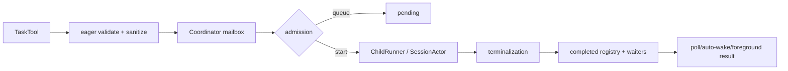
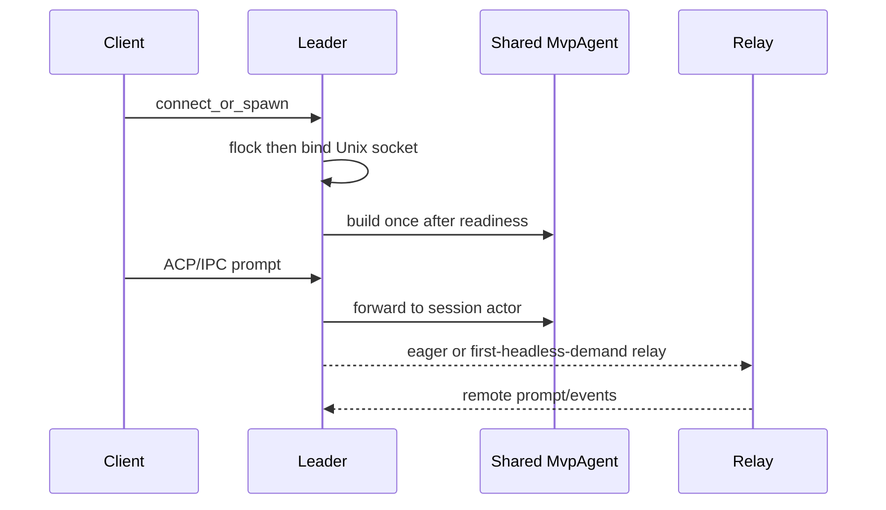

# 第十一章：Multi-Agent、Leader、后台任务与 Worktree

## 结论

Grok Build 的多 agent 运行时采用“工具入口 + 单写者 coordinator + 每个 child 独立
session actor”的结构。`task` 工具只负责参数清洗、类型/深度/模型预校验和等待策略；真正
的 pending queue、active/completed registry、取消、deadline、waiter 与 terminal delivery
由 coordinator actor 串行拥有。这样 foreground、background、workflow 和不同 host 的
child runner 可以共享生命周期不变量。

Leader 是另一层复用：它先抢 flock，再绑定 Unix socket，启动共享 `MvpAgent` 和 ACP/IPC
bridge；relay 可 eager 或等首个 headless client demand 后启动。Worktree isolation 是
child session 的 cwd/文件边界选择，和普通 `cwd` 参数互斥；fork 复制会话文件并记录 parent、
worktree kind 与 source workspace，实际创建/回收策略由 worktree backend 与 trust/sandbox
共同决定。

## Task 工具：校验与等待策略

TaskTool 的 resources 契约要求 `SubagentBackendResource`，可选深度计数器与 max depth；
默认最大嵌套深度是 1（[`task/mod.rs:1-47`](/home/qiqiang/opensource/grok-build/crates/codegen/xai-grok-tools/src/implementations/grok_build/task/mod.rs:1)）。
执行时先读取 depth、backend、当前 parent session/prompt 和 foreground wait guard；达到深度
上限立即返回 invalid arguments（[`task/mod.rs:337-435`](/home/qiqiang/opensource/grok-build/crates/codegen/xai-grok-tools/src/implementations/grok_build/task/mod.rs:337)）。

输入清洗包含：空/null resume id 视为 absent；`resume_from` 存在时忽略 model override；
cwd 与 `isolation=worktree` 同时出现时，真实存在的 cwd 报错，明显不存在的 cwd 被清空让
worktree 生效；普通 cwd 必须是现有目录。随后通过 coordinator `validate_type` 区分未知、
disabled、not-allowed、coordinator gone 与暂时不可用（[`task/mod.rs:437-560`](/home/qiqiang/opensource/grok-build/crates/codegen/xai-grok-tools/src/implementations/grok_build/task/mod.rs:437)）。

构造的 `SubagentRequest` 带 parent ids、runtime overrides、isolation、cancel token、
`owner=Task`，model-issued spawn 的 `fork_context` 固定为 false
（[`task/mod.rs:574-627`](/home/qiqiang/opensource/grok-build/crates/codegen/xai-grok-tools/src/implementations/grok_build/task/mod.rs:574)）。

两种等待模式不同：background 只等待“已登记/入队”的确认，立即返回 task id，子任务结果由
后续 poll/auto-wake 取得；blocking 默认等待 child result，若 foreground wait budget 到期，
coordinator 自动 background 并返回可轮询 id（[`task/mod.rs:629-735`](/home/qiqiang/opensource/grok-build/crates/codegen/xai-grok-tools/src/implementations/grok_build/task/mod.rs:629)）。
成功结果携带 output、turns、duration、tool calls 和可选 worktree path；失败转为模型可见
invalid arguments，而后台晚到失败只由 detached waiter 记录。

## Admission 与 coordinator 单写者

默认 admission 是每个 session 32 个并发 child，超限行为可配置为 queue 或 fail；workflow
agents 不占普通 session slot（[`task/admission.rs:1-134`](/home/qiqiang/opensource/grok-build/crates/codegen/xai-grok-tools/src/implementations/grok_build/task/admission.rs:1)）。
coordinator struct 独占 command receiver、admission、queue、pending/active/completed maps、
waiters、cancellation 和 terminal output；runner future 可 Send 或 non-Send，但状态修改只
在 actor 内完成（[`task/coordinator.rs:1-101`](/home/qiqiang/opensource/grok-build/crates/codegen/xai-grok-tools/src/implementations/grok_build/task/coordinator.rs:1)）。

actor select loop 同时处理内部事件、child completion、active-message、validation replies、
commands、caller abandoned 和 deadline；所有路径回到同一个 `finish_child`/drain queue 逻辑，
actor 在 command/ingress/future 都关闭且无运行任务后才退出
（[`coordinator.rs:265-358`](/home/qiqiang/opensource/grok-build/crates/codegen/xai-grok-tools/src/implementations/grok_build/task/coordinator.rs:265)）。
Spawn、Query、Cancel、Teardown、OpenAdmission、Outstanding、Completions、ValidateType 和
DescribeType 都是 mailbox event，而不是跨线程直接改 map
（[`coordinator.rs:360-579`](/home/qiqiang/opensource/grok-build/crates/codegen/xai-grok-tools/src/implementations/grok_build/task/coordinator.rs:360)）。

pending child 启动时递增 session running count，并为 foreground waiter 设 deadline；deadline
到达会把仍运行的 child 转 background，避免用户 turn 永久阻塞
（[`coordinator.rs:671-730`](/home/qiqiang/opensource/grok-build/crates/codegen/xai-grok-tools/src/implementations/grok_build/task/coordinator.rs:671)）。
terminalization 会写入 bounded completed registry、唤醒精确 waiter、生成 completion buffer，
然后 drain queue；完成记录有上限，防止长期 leader 内存无限增长
（[`coordinator.rs:896-1055`](/home/qiqiang/opensource/grok-build/crates/codegen/xai-grok-tools/src/implementations/grok_build/task/coordinator.rs:896)）。

## 取消、重入与 late spawn

spawn helper 会拒绝重复 task id、在 coordinator stop 后拒绝 late spawn，并按 admission 结果
启动、排队或返回 rejection（[`coordinator/spawn.rs:14-130`](/home/qiqiang/opensource/grok-build/crates/codegen/xai-grok-tools/src/implementations/grok_build/task/coordinator/spawn.rs:14)）。
嵌套 child 会 reparent 到 root parent，同时继承 workflow/loop lineage；正在 teardown 的 parent
禁止再 spawn（[`spawn.rs:132-172`](/home/qiqiang/opensource/grok-build/crates/codegen/xai-grok-tools/src/implementations/grok_build/task/coordinator/spawn.rs:132)）。
这组规则防止 Stop/delete 后一个迟到的 TaskTool 调用重新打开已关闭的会话 admission。

## Subagent definition、override 与 resume identity

`xai-grok-subagent-resolution` 只负责 definition discovery、toggle/allow-list、harness/tool
policy、prompt rendering；实际 child 生命周期仍在 shell/coordinator
（[`subagent-resolution/src/lib.rs:1-34`](/home/qiqiang/opensource/grok-build/crates/codegen/xai-grok-subagent-resolution/src/lib.rs:1)）。
definition 来源包括 builtin、project、user 和 plugin；project 可按 name shadow builtin，
并在构建 Task tool description 时保持 visible 与 callable 一致
（[`agent/discovery.rs:58-174`](/home/qiqiang/opensource/grok-build/crates/codegen/xai-grok-agent/src/discovery.rs:58)）。

runtime override precedence 是 explicit override > role > persona > parent/default；模型与
reasoning effort 分别解析，capability mode 取 override 与 role 的 intersection，persona 文件
I/O 错误可 fail-closed，而 role prompt 文件错误是 warning 后继续
（[`subagent-resolution/overrides.rs:52-145`](/home/qiqiang/opensource/grok-build/crates/codegen/xai-grok-subagent-resolution/src/overrides.rs:52)）。
resume 要求 requested subagent type 与 source 相同，显式 persona 也必须一致；model 不是
identity gate，shell 始终 pin source model 并静默忽略 resume model override
（[`subagent-resolution/resume.rs:1-65`](/home/qiqiang/opensource/grok-build/crates/codegen/xai-grok-subagent-resolution/src/resume.rs:1)）。

## Child session 构造与共享资源

shell 的 spawn actor 参数一次性携带 compaction/memory/MCP/subagent/worktree、permission、
plugin registry、scheduler、parent session 等配置；memory backend 会在 enabled 时建立并
初始化 watcher/index，MCP pool 可从 parent import shared clients，随后 `AgentRebuildSpec`
固化这些依赖用于初次 build 与后续 rebuild
（[`session/acp_session_impl/spawn.rs:183-330`](/home/qiqiang/opensource/grok-build/crates/codegen/xai-grok-shell/src/session/acp_session_impl/spawn.rs:183)；[`spawn.rs:776-1022`](/home/qiqiang/opensource/grok-build/crates/codegen/xai-grok-shell/src/session/acp_session_impl/spawn.rs:776)）。
共享 MCP client 不等于共享 session transcript：每个 child 仍有自己的 session id、persistence
actor、permission context 与 compaction state。

## Worktree isolation 与 fork

Task 输入中的 `isolation=worktree` 让 runner 创建隔离工作目录；普通 cwd 是“使用既有目录”，
两者不能同时指定。fork 文件层面使用新的 UUIDv7 session id，复制 chat/updates 与可选
compaction archive，并把 parent/session kind/source workspace 写入 summary；后端登记是后台
upsert（详见第 06 章的 [`fork.rs:50-145`](/home/qiqiang/opensource/grok-build/crates/codegen/xai-grok-shell/src/session/fork.rs:50)）。

worktree creation mode 有 `linked`（`git worktree add --no-checkout` 加 CoW copy）、
`standalone`（独立 `.git`）和 `git`（普通 full checkout），默认 linked；local config 优先于
remote settings（[`util/config/worktree.rs:6-85`](/home/qiqiang/opensource/grok-build/crates/codegen/xai-grok-shell/src/util/config/worktree.rs:6)）。
另一层 grove-vs-copy gate 按 request → env → local → remote 解析，remote unavailable 或
remote kill switch 最后 fail closed 为 copy（[`worktree.rs:131-183`](/home/qiqiang/opensource/grok-build/crates/codegen/xai-grok-shell/src/util/config/worktree.rs:131)）。
这意味着“worktree isolation”与“高速 grove/NFS 共享”是两个独立开关，不能从一个字段推断
另一个。

## Leader：锁、IPC、共享 agent 与 relay

`run_leader` 的启动顺序是：先获取 leader flock；清理旧 socket；创建 IPC channels 和
readiness watch；spawn IPC server 并在 auth 前绑定 Unix socket；等待 socket ready；执行有界
非交互 auth；发送 ready；最后在 `LocalSet` 中运行 agent、IPC/agent bridge、WS/agent bridge、
relay 与 config watcher（[`agent/app.rs:680-703`](/home/qiqiang/opensource/grok-build/crates/codegen/xai-grok-shell/src/agent/app.rs:680)；[`app.rs:725-860`](/home/qiqiang/opensource/grok-build/crates/codegen/xai-grok-shell/src/agent/app.rs:725)）。
如果已有进程持有 flock 且 socket 可用，新进程退出让 client 采用已有 leader；锁竞争有 bounded
reopen timeout，而不是无限等待（[`app.rs:728-769`](/home/qiqiang/opensource/grok-build/crates/codegen/xai-grok-shell/src/agent/app.rs:728)）。

relay 使用与 agent 相同的 `AuthManager`，避免两个 refresh lock 各自消费 token。默认
`relay_on_demand=false` 时 eager 连接；auto-spawned leader 可设 true，直到首个 headless IPC
client 注册才启动 WebSocket，TUI/IDE-only leader 不付出 relay clone/parse/TLS 开销。启动前
产生的消息不缓存在 relay，仍由本地 persistence 与后续 session replay 覆盖
（[`app.rs:535-611`](/home/qiqiang/opensource/grok-build/crates/codegen/xai-grok-shell/src/agent/app.rs:535)）。
无 auth 的 leader 不会永久禁用 relay；配置 watcher 后续拿到 relay-eligible token 时可
`DeferredRelayArm` 动态启动（[`app.rs:613-661`](/home/qiqiang/opensource/grok-build/crates/codegen/xai-grok-shell/src/agent/app.rs:613)）。

Leader server的 socket readiness 早于模型/settings prefetch，故本地 client 可以先连接；这
是降低启动延迟的实现事实，不表示远端 relay 或 model catalog 已经可用。

## 风险与可验证边界

- coordinator 的 bounded completed registry 只保留有限历史；客户端应使用 completion/poll
  协议，不依赖进程内 map 永久存在。
- background spawn 的“已登记”不等于“已完成”；网络/子进程晚失败不会改变最初的 terminal
  spawn acknowledgement。
- worktree mode 由多层配置和 remote kill switch 决定；remote unavailable 时源码选择 copy，
  因而不能把“请求了 grove”当作实际共享目录证明。
- leader relay 是 best-effort 外部连接；relay 启动前消息不回补到 WebSocket，但 session
  persistence/replay 提供本地恢复路径。
- fork/session 文件复制与 backend registration 分离；后端 upsert 失败不会撤销本地 child，
  也不会自动证明远端可见。

## 可验证证据表

| 结论 | 证据 |
|---|---|
| Task 资源与默认深度 | [`task/mod.rs:1-47`](/home/qiqiang/opensource/grok-build/crates/codegen/xai-grok-tools/src/implementations/grok_build/task/mod.rs:1) |
| Task 校验、request、background/blocking | [`task/mod.rs:337-735`](/home/qiqiang/opensource/grok-build/crates/codegen/xai-grok-tools/src/implementations/grok_build/task/mod.rs:337) |
| admission 限制 | [`task/admission.rs:1-134`](/home/qiqiang/opensource/grok-build/crates/codegen/xai-grok-tools/src/implementations/grok_build/task/admission.rs:1) |
| coordinator 单写者/select | [`task/coordinator.rs:1-101`](/home/qiqiang/opensource/grok-build/crates/codegen/xai-grok-tools/src/implementations/grok_build/task/coordinator.rs:1)、[`coordinator.rs:265-358`](/home/qiqiang/opensource/grok-build/crates/codegen/xai-grok-tools/src/implementations/grok_build/task/coordinator.rs:265) |
| terminalization/queue drain | [`coordinator.rs:896-1055`](/home/qiqiang/opensource/grok-build/crates/codegen/xai-grok-tools/src/implementations/grok_build/task/coordinator.rs:896) |
| nested spawn/reparent | [`task/coordinator/spawn.rs:132-172`](/home/qiqiang/opensource/grok-build/crates/codegen/xai-grok-tools/src/implementations/grok_build/task/coordinator/spawn.rs:132) |
| override precedence/resume identity | [`subagent-resolution/overrides.rs:52-145`](/home/qiqiang/opensource/grok-build/crates/codegen/xai-grok-subagent-resolution/src/overrides.rs:52)、[`resume.rs:33-65`](/home/qiqiang/opensource/grok-build/crates/codegen/xai-grok-subagent-resolution/src/resume.rs:33) |
| child session resources | [`session/acp_session_impl/spawn.rs:776-1022`](/home/qiqiang/opensource/grok-build/crates/codegen/xai-grok-shell/src/session/acp_session_impl/spawn.rs:776) |
| worktree type/gates | [`util/config/worktree.rs:6-85`](/home/qiqiang/opensource/grok-build/crates/codegen/xai-grok-shell/src/util/config/worktree.rs:6)、[`worktree.rs:131-183`](/home/qiqiang/opensource/grok-build/crates/codegen/xai-grok-shell/src/util/config/worktree.rs:131) |
| leader lock/socket/readiness | [`agent/app.rs:680-860`](/home/qiqiang/opensource/grok-build/crates/codegen/xai-grok-shell/src/agent/app.rs:680) |
| relay eager/on-demand/deferred auth | [`agent/app.rs:535-661`](/home/qiqiang/opensource/grok-build/crates/codegen/xai-grok-shell/src/agent/app.rs:535) |
