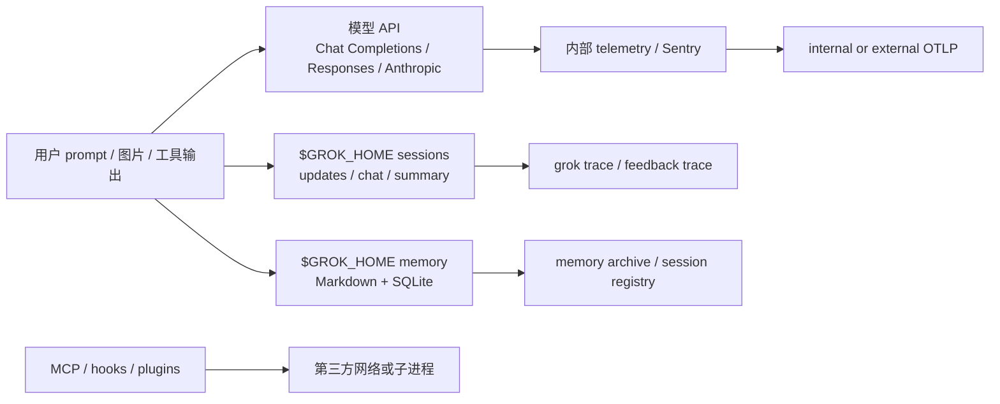

# 第十八章：用户隐私、数据流与规避建议

## 结论先行

Grok Build 的隐私边界由“请求内容、持久化文件、显式上传、扩展进程、遥测”五条流组成。默认配置会把 prompt、工具输出和项目路径发送给所选模型；session 与 memory 在本机以 Markdown/JSONL 保存；trace、memory archive、feedback 和外部 OTel 则是可选但真实的远端出口。代码有较完整的 secret/path 脱敏，却不能把脱敏误读为内容加密或不留存保证。

最重要的结论是：`/share` 当前实现直接返回“temporarily disabled”，并不等于所有上传都关闭；`grok trace`、feedback trace、memory registry 和外部 OTLP 仍由各自 gate 控制。用户需要逐项关闭，而不是只依赖一个“隐私”开关。

## 数据流地图

## 1. 模型请求是第一条外传边界

Sampling client 同时实现 Chat Completions、Responses SSE 与 Anthropic Messages；请求头会携带 `x-grok-*` 元数据（[`xai-grok-sampler/src/client.rs:1-58`](/home/qiqiang/opensource/grok-build/crates/codegen/xai-grok-sampler/src/client.rs:1)）。Responses 解析器会修正 `context_details`，最终 token 数会影响上下文和自动压缩（[`client.rs:90-122`](/home/qiqiang/opensource/grok-build/crates/codegen/xai-grok-sampler/src/client.rs:90)）。因此发送给模型的不只是用户最后一句话，还包括 system prompt、工具 schema、memory context、工作区路径和历史对话。

模型 endpoint、身份头和 deployment key 可由环境变量/managed config 改写；审计时应记录最终 endpoint，而不能只看默认 xAI URL。`TelemetryMode` 或 ZDR 只约束对应产品管线，不会阻止模型服务本身收到上下文。

## 2. 本地 session 与 memory：明文、可恢复，也可能被归档

Session persistence actor 依次写 `updates.jsonl`、`chat_history.jsonl`、`summary.json` 和 compaction archive；resume/replay 会从这些文件重建对话（[`xai-grok-shell/src/session/persistence.rs:1-20`](/home/qiqiang/opensource/grok-build/crates/codegen/xai-grok-shell/src/session/persistence.rs:1)）。Memory crate 将全局、workspace 与 session note 写入 `~/.grok/memory/`，再建立 SQLite FTS/vector 索引（[`xai-grok-memory/src/lib.rs:1-19`](/home/qiqiang/opensource/grok-build/crates/codegen/xai-grok-memory/src/lib.rs:1)；[`index.rs:80-100`](/home/qiqiang/opensource/grok-build/crates/codegen/xai-grok-memory/src/index.rs:80)）。这些文件是恢复能力的基础，但源码未提供统一内容加密；文件系统权限和备份策略决定泄露半径。

Memory archive 会跳过 symlink、FIFO 和超过单文件上限的条目，并以 no-follow 方式打开文件（[`xai-grok-memory/src/archive.rs:1-132`](/home/qiqiang/opensource/grok-build/crates/codegen/xai-grok-memory/src/archive.rs:1)）。这是防止符号链接偷取宿主文件的输入完整性保护，不是机密保护：归档一旦上传，内容仍由目标 bucket/代理保留。

## 3. 显式上传出口：trace、feedback 与 share

### Trace

`grok trace` 支持 `--local`，否则先检查 `is_trace_upload_enabled()`，解析 proxy、GCS 或 S3 方式，再以超时和重试上传压缩归档；失败时还会在本地生成 `.upload.log`（[`xai-grok-pager/src/trace_cmd.rs:35-67`](/home/qiqiang/opensource/grok-build/crates/codegen/xai-grok-pager/src/trace_cmd.rs:35)；[`trace_cmd.rs:421-506`](/home/qiqiang/opensource/grok-build/crates/codegen/xai-grok-pager/src/trace_cmd.rs:421)）。`--local` 是最可靠的单次规避方式；仅把 telemetry 设为 disabled 并不能覆盖显式 trace 命令。

### Feedback

`/feedback` 在完整 TUI 中打开报告面板，minimal 模式带文本时立即生成 `SendFeedback` action（[`xai-grok-pager/src/slash/commands/feedback.rs:1-45`](/home/qiqiang/opensource/grok-build/crates/codegen/xai-grok-pager/src/slash/commands/feedback.rs:1)）。效果层把 feedback text、图片、session id、版本和 terminal info 组装为 `x.ai/feedback` 请求（[`xai-grok-pager/src/app/effects/mod.rs:3646-3717`](/home/qiqiang/opensource/grok-build/crates/codegen/xai-grok-pager/src/app/effects/mod.rs:3646)）。若用户同意上传关联 trace，另一个 action 会调用 `x.ai/feedback/upload-trace`，带 session id 并受单独 timeout 约束（[`effects/mod.rs:3718-3770`](/home/qiqiang/opensource/grok-build/crates/codegen/xai-grok-pager/src/app/effects/mod.rs:3718)）。反馈文本可能包含代码和错误输出；提交前应手动删除敏感内容。

### Share

命令层和顶层 `share` 子命令目前都明确返回“Session sharing is temporarily disabled”（[`slash/commands/share.rs:1-23`](/home/qiqiang/opensource/grok-build/crates/codegen/xai-grok-pager/src/slash/commands/share.rs:1)；[`share_cmd.rs:1-20`](/home/qiqiang/opensource/grok-build/crates/codegen/xai-grok-pager/src/share_cmd.rs:1)）。这是当前 checkout 的实现事实，不应推断为未来版本的隐私承诺；若服务端重新启用，必须重新审查共享 URL 的访问控制和 transcript 范围。

## 4. Telemetry 与身份元数据

内部 telemetry 默认按 `Disabled/SessionMetrics/Enabled` 分层，Sentry `before_send` 会清理路径、异常文本和 tags（[`xai-grok-telemetry/src/config.rs:1-20`](/home/qiqiang/opensource/grok-build/crates/codegen/xai-grok-telemetry/src/config.rs:1)；[`sentry.rs:29-75,193-239`](/home/qiqiang/opensource/grok-build/crates/codegen/xai-grok-telemetry/src/sentry.rs:29)）。Secret sanitizer 覆盖 token、URL query、HOME 和用户路径（[`xai-grok-secrets/src/sanitizer.rs:8-108,180-309`](/home/qiqiang/opensource/grok-build/crates/codegen/xai-grok-secrets/src/sanitizer.rs:8)），但脱敏后仍可能保留 session id、model、tool/skill/MCP token count、cwd 的结构性指纹。

External OTLP 要求环境变量显式开启并至少配置 exporter；prompt/response/tool body gate 默认关闭，开启后由 customer collector 决定留存（[`xai-grok-telemetry/src/external/config.rs:72-89,628-654`](/home/qiqiang/opensource/grok-build/crates/codegen/xai-grok-telemetry/src/external/config.rs:72)；[`external/mod.rs:148-179`](/home/qiqiang/opensource/grok-build/crates/codegen/xai-grok-telemetry/src/external/mod.rs:148)）。这条流独立于 xAI 产品 telemetry，`user.email` 等 identity 字段也不受 content gate 影响。

## 5. MCP、Hooks 与 Plugins 的第三方边界

MCP OAuth token 存于独立的 `mcp_credentials.json`；stdio MCP 的 command、环境变量和网络能力来自配置，HTTP/SSE transport 没有自动复用 WebFetch 的 SSRF gate（[`xai-grok-mcp/src/credentials.rs:1-45,85-136`](/home/qiqiang/opensource/grok-build/crates/codegen/xai-grok-mcp/src/credentials.rs:1)；[`xai-grok-mcp/src/servers.rs:4098-4140,4680-4820`](/home/qiqiang/opensource/grok-build/crates/codegen/xai-grok-mcp/src/servers.rs:4098)）。

Command hook 支持 `sh -c` 和 source_dir 脚本，HTTP hook 发送 JSON 到配置 URL；两者可能接触 prompt、工具结果和 workspace metadata。Hook 失败大多 fail-open，而 matcher 错误为 `never()`（[`xai-grok-hooks/src/runner/command.rs:55-180`](/home/qiqiang/opensource/grok-build/crates/codegen/xai-grok-hooks/src/runner/command.rs:55)；[`dispatcher.rs:20-42,216-229`](/home/qiqiang/opensource/grok-build/crates/codegen/xai-grok-hooks/src/dispatcher.rs:20)）。插件安装可跟随 mutable ref；`require_sha` 默认关闭，故插件来源和版本应视为供应链与数据边界问题。

## 6. 用户可执行的规避清单

1. 不需要上传时使用 `grok trace --local`；不要把 `GROK_TELEMETRY_TRACE_UPLOAD=1`、bucket、proxy URL 和 trace credentials 留在全局 shell profile。
2. 首次运行前审查 `~/.grok/config.toml`、managed config 和环境变量，确认 model endpoint、external OTLP endpoint、MCP URL 与 hook URL 均为组织允许的目的地。
3. 将 `$GROK_HOME` 放在加密磁盘；限制目录权限，清理 `.corrupt.*`、`.upload.log`、旧 session 与 memory archive 备份。
4. 关闭不需要的 `features.telemetry`、external OTLP content gates、memory/session registry、MCP servers、hooks 与 plugins；关闭前后检查实际 resolved config，而不是只改一层 TOML。
5. 反馈前删去源码、token、内部 URL、客户标识和完整错误输出；在 minimal 模式避免使用带参数的 `/feedback` 直接提交。
6. 对不信任仓库先拒绝 folder trust；不使用 `/workspace`、MCP HTTP 或 hook HTTP 访问内网服务。
7. 企业环境将 `marketplace.require_sha=true` 固定为 policy，审核 plugin commit；把 `OTEL_EXPORTER_OTLP_HEADERS` 和 deployment credentials 当作机密处理。

## 7. 证据索引

| 结论 | 主要证据 |
|---|---|
| 本地 session/memory 明文布局 | [`persistence.rs`](/home/qiqiang/opensource/grok-build/crates/codegen/xai-grok-shell/src/session/persistence.rs:1)、[`memory/lib.rs`](/home/qiqiang/opensource/grok-build/crates/codegen/xai-grok-memory/src/lib.rs:1) |
| trace 上传与 `--local` | [`trace_cmd.rs`](/home/qiqiang/opensource/grok-build/crates/codegen/xai-grok-pager/src/trace_cmd.rs:35) |
| feedback/trace feedback | [`effects/mod.rs`](/home/qiqiang/opensource/grok-build/crates/codegen/xai-grok-pager/src/app/effects/mod.rs:3646) |
| share 当前禁用 | [`share.rs`](/home/qiqiang/opensource/grok-build/crates/codegen/xai-grok-pager/src/slash/commands/share.rs:1) |
| sanitizer 与 Sentry | [`sanitizer.rs`](/home/qiqiang/opensource/grok-build/crates/codegen/xai-grok-secrets/src/sanitizer.rs:8)、[`sentry.rs`](/home/qiqiang/opensource/grok-build/crates/codegen/xai-grok-telemetry/src/sentry.rs:29) |
| external OTLP gate | [`external/config.rs`](/home/qiqiang/opensource/grok-build/crates/codegen/xai-grok-telemetry/src/external/config.rs:72) |
| MCP/hooks 扩展出口 | [`servers.rs`](/home/qiqiang/opensource/grok-build/crates/codegen/xai-grok-mcp/src/servers.rs:4098)、[`command.rs`](/home/qiqiang/opensource/grok-build/crates/codegen/xai-grok-hooks/src/runner/command.rs:55) |
