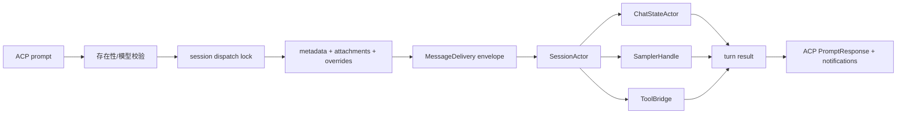

# Agent 执行流程

```mermaid
flowchart LR
  A[ACP prompt] --> B[存在性/模型校验]
  B --> C[session dispatch lock]
  C --> D[metadata + attachments + overrides]
  D --> E[MessageDelivery envelope]
  E --> F[SessionActor]
  F --> G[ChatStateActor]
  F --> H[SamplerHandle]
  F --> I[ToolBridge]
  G --> J[turn result]
  H --> J
  I --> J
  J --> K[ACP PromptResponse + notifications]
```

来源：[第 03 章：Agent loop 与 ACP](../analysis/03-agent-loop-and-acp.md)。
