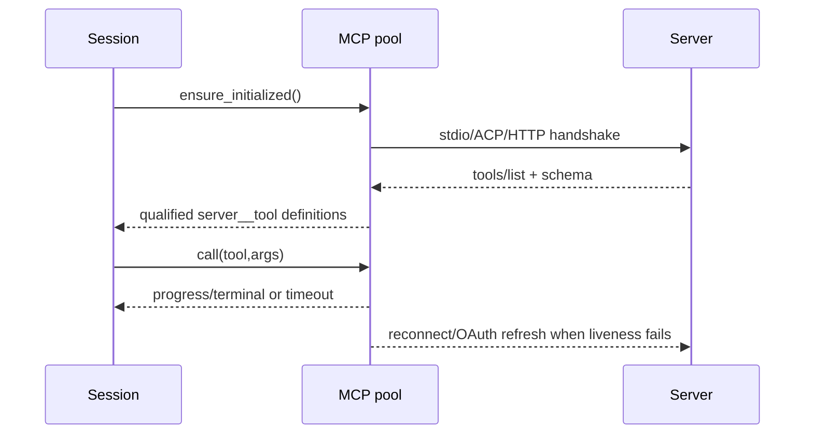

# MCP 集成流程

```mermaid
sequenceDiagram
  participant S as Session
  participant P as MCP pool
  participant C as Server
  S->>P: ensure_initialized()
  P->>C: stdio/ACP/HTTP handshake
  C-->>P: tools/list + schema
  P-->>S: qualified server__tool definitions
  S->>P: call(tool,args)
  P-->>S: progress/terminal or timeout
  P-->>C: reconnect/OAuth refresh when liveness fails
```

来源：[第 08 章：MCP、Skills、Plugins、Hooks 与 Workflow](../analysis/08-mcp-skills-plugins.md)。
