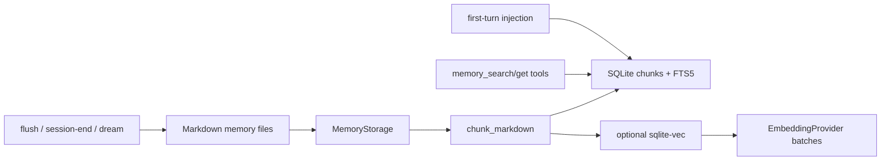

# Memory 管理流程

```mermaid
flowchart LR
  A[Markdown memory files] --> B[MemoryStorage]
  B --> C[chunk_markdown]
  C --> D[SQLite chunks + FTS5]
  C --> E[optional sqlite-vec]
  E --> F[EmbeddingProvider batches]
  G[memory_search/get tools] --> D
  H[first-turn injection] --> D
  I[flush / session-end / dream] --> A
```

来源：[第 07 章：Memory、Embedding 与 Compaction](../analysis/07-memory-and-compaction.md)。
