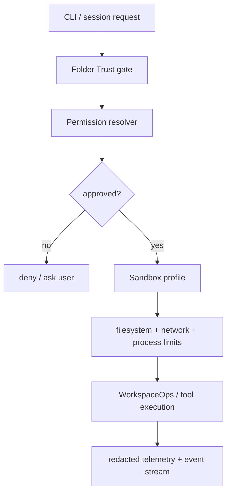

# Sandbox 权限控制

```mermaid
flowchart TD
  A[CLI / session request] --> B[Folder Trust gate]
  B --> C[Permission resolver]
  C --> D{approved?}
  D -->|no| E[deny / ask user]
  D -->|yes| F[Sandbox profile]
  F --> G[filesystem + network + process limits]
  G --> H[WorkspaceOps / tool execution]
  H --> I[redacted telemetry + event stream]
```

来源：[第 09 章：Sandbox、Permission 与 Folder Trust](../analysis/09-sandbox-permission-trust.md)；数据出口参见[第 18 章：用户隐私、数据流与规避建议](../analysis/18-privacy-and-data-flow.md)。
