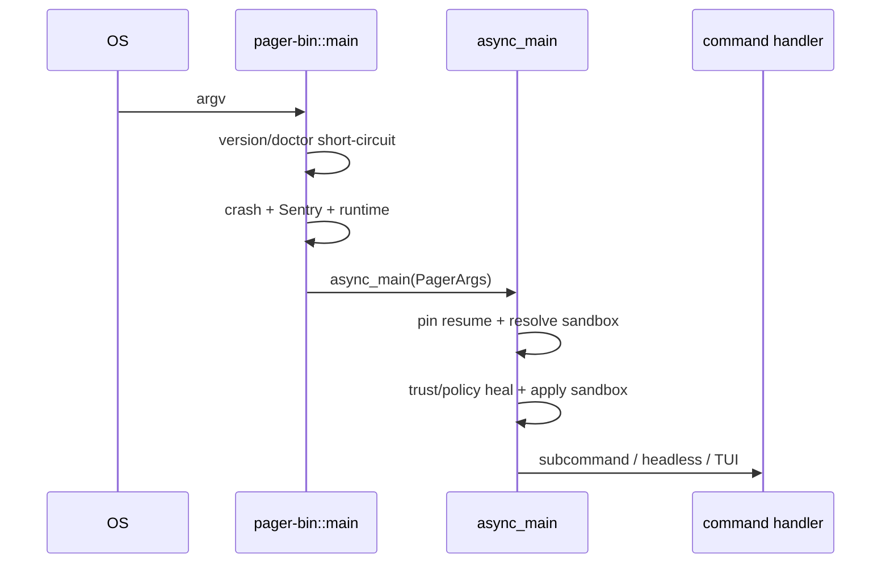

# CLI 启动流程

```mermaid
sequenceDiagram
  participant OS
  participant Main as pager-bin::main
  participant Async as async_main
  participant Cmd as command handler
  OS->>Main: argv
  Main->>Main: version/doctor short-circuit
  Main->>Main: crash + Sentry + runtime
  Main->>Async: async_main(PagerArgs)
  Async->>Async: pin resume + resolve sandbox
  Async->>Async: trust/policy heal + apply sandbox
  Async->>Cmd: subcommand / headless / TUI
```

来源：[第 02 章：启动顺序与 CLI 分流](../analysis/02-startup-and-cli.md)。
