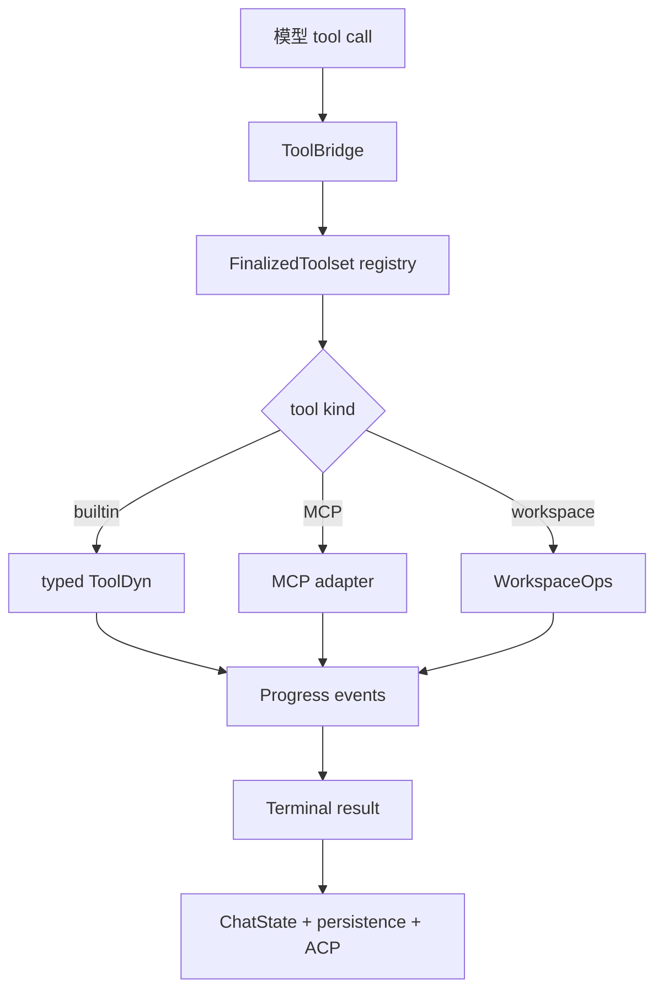

# Tool Call 调用流程

```mermaid
flowchart TD
  A[模型 tool call] --> B[ToolBridge]
  B --> C[FinalizedToolset registry]
  C --> D{tool kind}
  D -->|builtin| E[typed ToolDyn]
  D -->|MCP| F[MCP adapter]
  D -->|workspace| G[WorkspaceOps]
  E --> H[Progress events]
  F --> H
  G --> H
  H --> I[Terminal result]
  I --> J[ChatState + persistence + ACP]
```

来源：[第 04 章：Tool Call、registry 与流式协议](../analysis/04-tool-call-runtime.md)。
