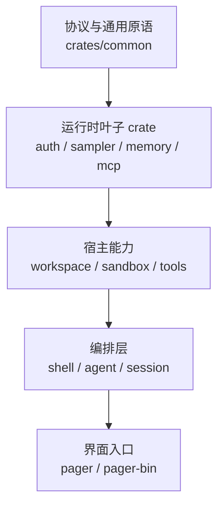

# Crate / 组件总览

Grok Build 没有前端 TUI 组件目录可以直接照搬参考站的 `components/` 章节；它的
可复用边界主要由 Rust crate、协议类型和宿主 facade 组成。本页把这些 crate 当作
“组件”来读，重点是依赖方向和运行时责任，而不是逐函数罗列。

## 分层原则

| 层 | 代表 crate | 主要责任 |
| --- | --- | --- |
| 协议与通用原语 | `xai-tool-runtime`、`xai-tool-types`、`xai-grok-compaction` | 工具流、协议模型和压缩抽象，不直接依赖 TUI |
| 运行时叶子 | `xai-grok-sampler`、`xai-grok-memory`、`xai-grok-mcp`、`xai-grok-auth` | 网络采样、记忆索引、MCP transport、凭据与 OAuth |
| 宿主能力 | `xai-grok-workspace`、`xai-grok-sandbox`、`xai-grok-tools` | 文件/VCS/终端、隔离 profile、工具 registry 与 bridge |
| 编排层 | `xai-grok-agent`、`xai-grok-shell` | agent definition、session actor、turn、扩展和持久化 |
| 入口与界面 | `xai-grok-pager`、`xai-grok-pager-bin` | TUI/headless/ACP 入口、CLI 分流和 composition root |

依赖方向、crate 清单和生成边界见[第 16 章：源码树与 crate 地图](../../../analysis/16-source-tree.md)；
一次请求如何穿过这些边界见[架构快览](../guide/architecture-overview.md)。

## 阅读组件时的三个问题

1. **谁拥有状态？** `SessionActor`/`ChatStateActor` 负责 turn 内的串行状态，叶子 crate
   通常通过 handle 或 typed interface 提供能力。
2. **谁决定权限？** workspace、permission、folder trust 和 sandbox 是不同闸门；不要把
   `xai-grok-tools` 的 registry 当成唯一安全边界。
3. **谁承载证据？** 本站章节中的源码链接固定在 `SOURCE_REF`，组件索引只做导航，不替代
   具体实现审计。
