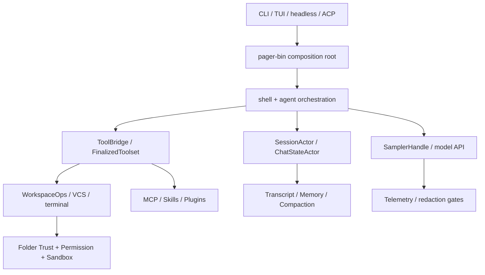

# 架构快览

可以把 Grok Build 看成五层：入口负责分流，shell/agent 负责编排，工具和 workspace
提供能力，session/memory 保存上下文，trust/permission/sandbox 把宿主操作围起来。

## 一次 turn 的边界

1. 入口把用户输入或 ACP request 交给 shell；session dispatch lock 保证同一会话的
   turn 按序处理。
2. Agent 组装 prompt、工具目录和上下文快照，再通过 sampler 发起流式模型请求。
3. 模型产生的 tool call 经 ToolBridge 路由到内置、workspace 或 MCP 适配器；执行过程
   以 progress 事件回流，最后产生 terminal 结果。
4. Chat state、transcript、memory 和 telemetry 各自接收事件；compaction 可以在预算
   不足时替换旧 conversation segment，而不是简单截断字符串。

## 边界不要混淆

| 边界 | 解决的问题 | 不能替代 |
| --- | --- | --- |
| Folder Trust | 是否信任项目配置/扩展来源 | 工具动作审批 |
| Permission | 某个动作是否允许执行 | 进程和网络隔离 |
| Sandbox | 文件、网络、子进程的宿主限制 | 内容脱敏和凭据策略 |
| Telemetry gate | 是否上传、如何去敏 | 本地明文落盘保护 |

更细的启动、Agent、Tool Call、MCP、Memory 和 Sandbox 图见[架构流程图](../../../diagrams/startup-flow.md)。
完整证据链见[第 01 章](../../../analysis/01-architecture-overview.md)和[第 15 章](../../../analysis/15-code-evidence-index.md)。
